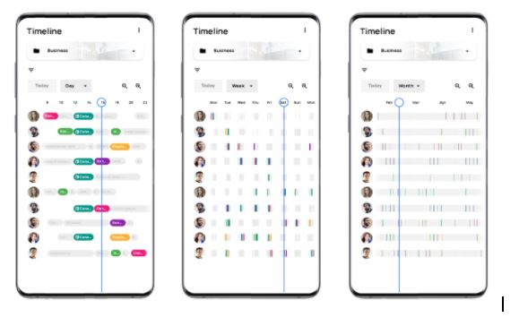

# Časová osa Gantt.AI™

Časová osa Gantt.AI™ poskytuje vždy aktuální přehled nad prioritizací úkolů jednotlivých uživatelů. Je na ní zaznačeno kdo, kdy a na čem má pracovat, kdy se na jednotlivých úkolech skutečně pracovalo a kdy byly dokončeny. Priority úkolů jsou nastaveny umělou inteligencí na základě mnoha parametrů. Pokud dojde k jakékoliv změně, např. zaměstnanec nedorazí do práce, umělá inteligence najde optimální řešení a celý harmonogram naplánuje tak, aby bylo vše dokončeno v termínu.

## Výběr projektu

Pomocí rozbalovací nabídky můžete vybrat konkrétní projekt, který vás zajímá. Tím zobrazíte pouze ty uživatele, kteří jsou v daném projektu zainteresovaní a úkoly v něm obsažené se barevně zvýrazní. Zůstanou ale viditelné úkoly i z ostatních projektů, aby bylo vidět, co ovlivnilo plánování vybraného projektu.

{: loading=lazy }

## Datum

Pro zobrazení konkrétního časového rozmezí zvolte datum šipkami, nebo jej rovnou upravte. Kliknutím na tlačítko “Dnes” se rychle dostanete zpět na aktuální den.

{: loading=lazy }

## Formát zobrazení

Časovou osu můžete zobrazit po dnech, týdnech nebo měsících. Můžete tak získat nadhled nad celým projektem a zjistit, kdy se na projektu bude pracovat intenzivně a kdy je naplánováno méně úkolů.

{: loading=lazy }

## Filtr

Časovou osu konkrétních uživatelů zobrazíte pomocí filtru.

## Lupa 

Časovou osu přiblížite či oddálíte pomocí lupy.

{: loading=lazy }

## Pracovní doba

Po kliknutí na tři tečky v pravém horním rohu můžete upravit pracovní dobu. Vymezíte tím uživatelům časové úseky do kterých se jim plánují přidělené úkoly

Pracovní doba jednotlivých zaměstnanců je vyznačena na časové ose závorkami.

## Upozornění

Výhod časové osy využijete naplno až tehdy, pokud deadline nastavíte pouze těm úkolům, které jej skutečně vyžadují. Necháte tak umělé inteligenci prostor na optimalizaci harmonogramu. Termín dokončení stačí nastavit pouze projektu a všechny úkoly se naplánují tak, aby byl projekt v tomto termínu dokončen. Pokud se něco nestihne dle plánu či nastane nějaká neočekávaná událost, časová osa se ihned přeplánuje.

Na časové ose jsou viditelné pouze ty projekty, které mají povolenou funkci AI plánování. Projeky které tuto funkci povolenou nemají, nemohou být na časové ose plánovány. Je důležité, aby AI plánování měly povoleno jen ty projekty, které jsou již připraveny ke zpracování (jsou zmapovány v ProjectFormation™) jinak by následnými změnami neustále zasahovaly do plánu a APU by nemohl poskytovat relevantní odhady dokončení ostatních projektů.

Ne vždy lze naplánovat časovou osu tak, aby bylo možné vše splnit v požadovaném termínu. V takovém případě vás APU upozorní na pravděpodobné nedokončení úkolu v termínu, příp. na již překročený deadline.
