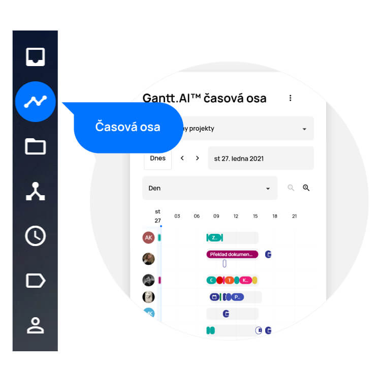
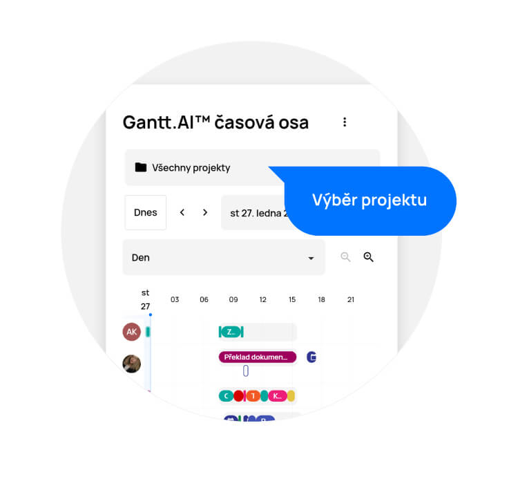
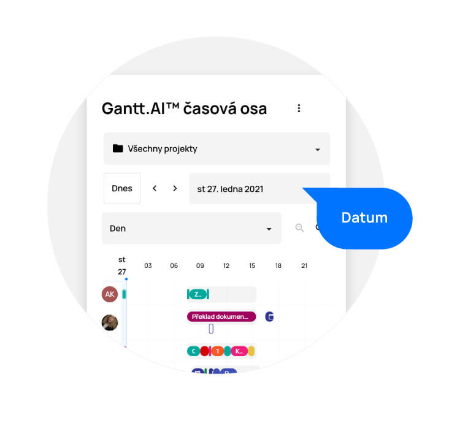
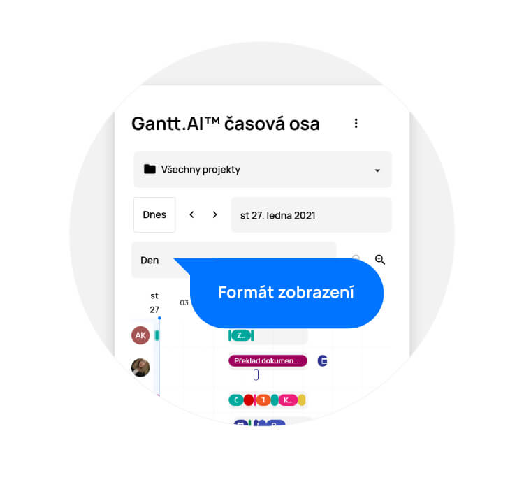
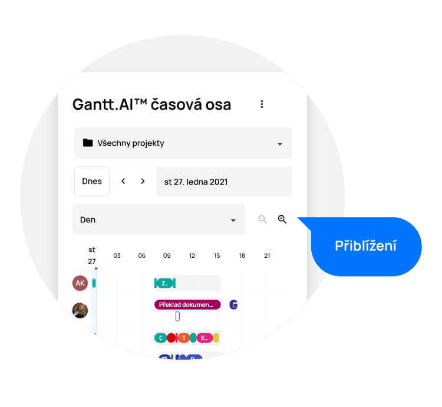

# Časová osa Gantt.AI™

> Časová osa Gantt.AI™ poskytuje vždy aktuální přehled nad prioritizací úkolů jednotlivých uživatelů a také jejich časové vytížení. Je na ní zaznačeno, kdo, kdy a na čem má pracovat a kdy se na jednotlivých úkolech skutečně pracovalo. Pokud máte vy nebo vaši kolegové aktivovanou integraci kalendáře, vidíte na časové ose také události, které mají jednotliví uživatelé naplánované. APU na tuto dobu nebude plánovat žádné úkoly. Priority úkolů jsou nastaveny umělou inteligencí na základě mnoha parametrů. Pokud dojde k jakékoliv změně, např. zaměstnanec nedorazí do práce, umělá inteligence najde optimální řešení a celý harmonogram naplánuje tak, aby bylo vše dokončeno v termínu, co nejlevněji a v nejkratší možné době.

Časovou osu naleznete na levém bočním menu, pod ikonkou grafu. Po kliknutí uvidíte přehled časového harmonogramu všech ve firmě.

<figure>
	<a href="../../../assets/images/cs/casova-osa-gantt.jpg" title="Časová osa Gantt.AI™" class="glightbox">
		
		<figcaption>Časová osa Gantt.AI™</figcaption>
	</a>
</figure>

## Časové vytížení
Pod jménem každého uživatele je v procentech uvedenojeho časové vytížení na nadcházející pracovní dobu.

## Výběr projektu
Pomocí rozbalovací nabídky můžete vybrat konkrétní projekt, který vás zajímá. Tím zobrazíte pouze ty uživatele, kteří jsou v daném projektu zainteresovaní a úkoly v něm obsažené se barevně zvýrazní. Zůstanou ale viditelné úkoly i z ostatních projektů, aby bylo vidět, co ovlivnilo plánování vybraného projektu.

<figure>
	<a href="../../../assets/images/cs/gantt-vyber-projektu.jpg" title="Výběr projektu" class="glightbox">
		
		<figcaption>Výběr projektu</figcaption>
	</a>
</figure>

## Datum
Pro zobrazení konkrétního časového rozmezí zvolte datum šipkami, nebo jej rovnou upravte. Kliknutím na tlačítko „Dnes“ se rychle dostanete zpět na aktuální den.

<figure>
	<a href="../../../assets/images/cs/gantt-datum.jpg" title="Datum" class="glightbox">
		
		<figcaption>Datum</figcaption>
	</a>
</figure>

## Formát zobrazení
Časovou osu můžete zobrazit po dnech, týdnech nebo měsících. Můžete tak získat nadhled nad celým projektem a zjistit, kdy se na projektu bude pracovat intenzivně a kdy je naplánováno méně úkolů.

<figure>
	<a href="../../../assets/images/cs/gantt-format-zobrazeni.jpg" title="Formát zobrazení" class="glightbox">
		
		<figcaption>Formát zobrazení</figcaption>
	</a>
</figure>

## Přiblížení a oddálení časové osy

Časovou osu přiblížite či oddálíte pomocí lupy.

<figure>
	<a href="../../../assets/images/cs/gantt-priblizeni-a-oddaleni.jpg" title="Přiblížení a oddálení časové osy" class="glightbox">
		
		<figcaption>Přiblížení a oddálení časové osy</figcaption>
	</a>
</figure>

**Upozornění**: Výhod časové osy využijete naplno až tehdy, pokud deadline nastavíte pouze těm úkolům, které ji skutečně vyžadují. Necháte tak umělé inteligenci prostor na optimalizaci harmonogramu. Termín dokončení stačí nastavit pouze projektu a všechny úkoly se naplánují tak, aby byl projekt v tomto termínu dokončen. Pokud se něco nestihne dle plánu či nastane nějaká neočekávaná událost, časová osa se ihned přeplánuje.

**Upozornění**: Na časové ose jsou viditelné pouze ty projekty, které mají povolenou funkci AI plánování. Projeky, které tuto funkci povolenou nemají, nemohou být na časové ose plánovány. Je důležité, aby AI plánování měly povoleno jen ty projekty, které jsou již připraveny ke zpracování (jsou zmapovány v ProjectFormation™), jinak by následnými změnami neustále zasahovaly do plánu a APU by nemohl poskytovat relevantní odhady dokončení ostatních projektů.

**Upozornění**: Ne vždy lze naplánovat časovou osu tak, aby bylo možné vše splnit v požadovaném termínu. V takovém případě vás APU upozorní na pravděpodobné nedokončení úkolu v termínu, příp. na již překročenou deadline.