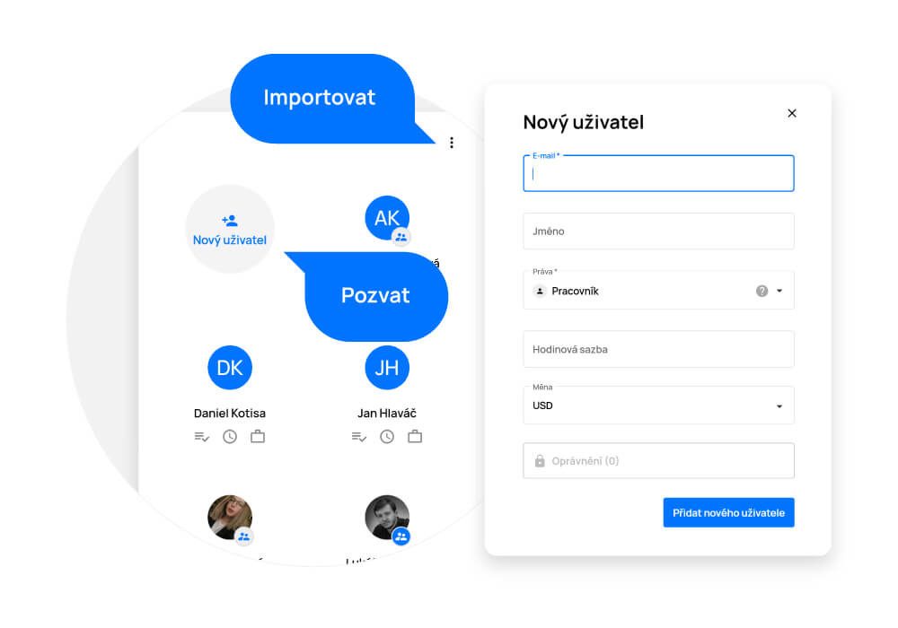
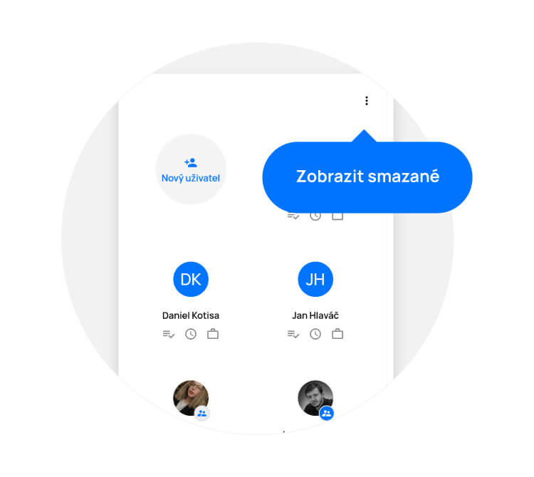

# Lidé

> Sekce „Lidé“ slouží ke správě jednotlivých uživatelů. Lze odsud upravovat jejich základní údaje, pracovní dobu, hodinovou sazbu, přidělovat jim práva a mnoho dalšího.

<figure>
	<a href="../../../assets/images/lide.jpg" title="Lidé" class="glightbox">
		
		<figcaption>Lidé</figcaption>
	</a>
</figure>

## Přidání uživatele
Nového uživatele přidáte do aplikace kliknutím na tlačítko „Nový uživatel“, nebo tlačítkem „+“ v pravém dolním rohu.

- V otevřeném okně vyplňte jméno a e-mail.
- Pole „Práva“ definuje práva uživatele v rámci aplikace. Na výběr máte ze tří možností – Vedení, Projektový koordinátor, Pracovník (ve výchozím stavu je vždy nastaveno právo Pracovník).
- Můžete uživatele také přiřadit to skupiny, např. Dle firemních oddělení.
- V dalším políčku je možné nastavit hodinovou sazbu a měnu.

Uživatele a jeho nastavení uložte tlačítkem „Přidat nového uživatele“.

Na panelu lze na první pohled podle hvězdiček u avataru uživatele poznat, kdo má jaké oprávnění. Vedení je označeno modrou hvězičkou, projektový manažer bílou a pracovník nemá zobrazenou hvězdičku žádnou.

Možnost importu uživatelů z Google či Microsoft Directory naleznete v nabídce „Více“ (tři tečky) v pravém horním rohu kliknutím na položku „Importovat z Google Directory“ či „Importovat z Microsoft Directory”.

Pod uživatelem poté jako vedení uvidíte také možnosti „Zobrazit úkoly”, „Zobrazit strávený čas” a „Nastavit pracovní dobu”.

U každého uživatele lze také vidět jeho celkové pracovní vytížení v procentech.

<figure>
	<a href="../../../assets/images/lide-pridani-uzivatele.jpg" title="Přidání uživatele" class="glightbox">
		
		<figcaption>Přidání uživatele</figcaption>
	</a>
</figure>

## Úprava uživatele
Klikněte na ikonu daného uživatele a tím otevřete nabídku nastavení. Měnit můžete jméno, e-mail, uživatelská práva, a oprávnění v jednotlivých projektech. Můžete také nastavit hodinovou sazbu a měnu.

Provedené změny uložte tlačítkem „Potvrdit změny“.

<figure>
	<a href="../../../assets/images/lide-uprava-uzivatele.jpg" title="Úprava uživatele" class="glightbox">
		
		<figcaption>Úprava uživatele</figcaption>
	</a>
</figure>

## Pracovní doba
Pracovní doba vymezuje jednotlivým uživatelům časové úseky do kterých se jim plánují přidělené úkoly. Odpovídá tedy časovému rozmezí, ve kterém jsou zaměstnanci k dispozici, např. kdy jsou přítomni v kanceláři.

### Úprava pracovní doby:
Pracovní doba je ve výchozím stavu nastavena na 8.00-16.00. Upravit pracovní dobu může pouze vedení po rozkliknutí „Nastavit pracovní dobu“ (ikona kufru). Poté je třeba zvolit časové pásmo (výchozí je Praha) a potáhnutím puntíků nastavit rozmezí pracovní doby.

V případě, že je potřeba pracovní dobu rozdělit na více částí, například kvůli pauzy či více směn v jednom dni, lze klikem na tlačítko „Přidat časový slot” přidat další část pracovní doby. Pro odebrání části pracovní doby stačí kliknout na ikonku koše.

Upravenou pracovní dobu lze obnovit do výchozího stavu pomocí tlačítka „Obnovit”.

Pracovní doba jednotlivých zaměstnanců je poté vyznačena na časové ose.

**Upozornění:** Po provedení změn je nutné kliknout na tlačítko “Potvrdit”. Pokud dojde např. k zavření prohlížeče nebo ztrátě internetového připojení, provedené změny nebudou uloženy.

**Upozornění:** Změna pracovní doby přímo ovlivní plánování úkolů na časové ose. Pokud je zvolená pracovní doba příliš krátká, je možné že některé úkoly nebude v jejím rámci možné realizovat, příp. se neúměrně navýší odhadovaný čas pro dokončení projektu. Toto nemá vliv pouze na jednotlivce ale může poznamenat i plán pro celý tým.

**Upozornění:** Úkoly a eventy (např. položky z kalendáře) které mají pevné datum konání se plánují i mimo pracovní dobu.

## Odebrání uživatele
Pro odebrání uživatele otevřete nabídku „Upravit uživatele“ kliknutím na jeho profilový obrázek a poté jej kliknutím na tlačítko „Smazat“ odeberete.

Upozornění: Odebraný uživatel bude pouze archivovaný a veškerá data zůstanou zachována pro případné obnovení.

<figure>
	<a href="../../../assets/images/lide-odebrani-uzivatele.jpg" title="Odebrání uživatele" class="glightbox">
		
		<figcaption>Odebrání uživatele</figcaption>
	</a>
</figure>

## Obnovení uživatele
Pro obnovení uživatele klikněte na ikonu „Více“ (tři tečky) v pravém horním rohu a klikněte na položku „Smazaní“. Zobrazí se vám seznam odebraných uživatelů. U uživatele, kterého chcete obnovit, otevřete nabídku „Upravit uživatele“ kliknutím na jeho profilový obrázek a poté jej kliknutím na tlačítko „Obnovit“ obnovíte.

Upozornění: Správu jednotlivých uživatelů může provádět pouze osoba s právy vedení.

<figure>
	<a href="../../../assets/images/lide-obnoveni-uzivatele.jpg" title="Obnovení uživatele" class="glightbox">
		
		<figcaption>Obnovení uživatele</figcaption>
	</a>
</figure>

## Graf časového vytížení
Graf časového vytížení uživatelů zobrazíte kliknutím na ikonu grafu v pravém horním rohu sekce „Lidé“. Na grafu je zobrazena vytíženost jednotlivých uživatelů na následující období. Můžete si také vyfiltrovat rozsah a agregaci vytížení pro detailnější přehled.
