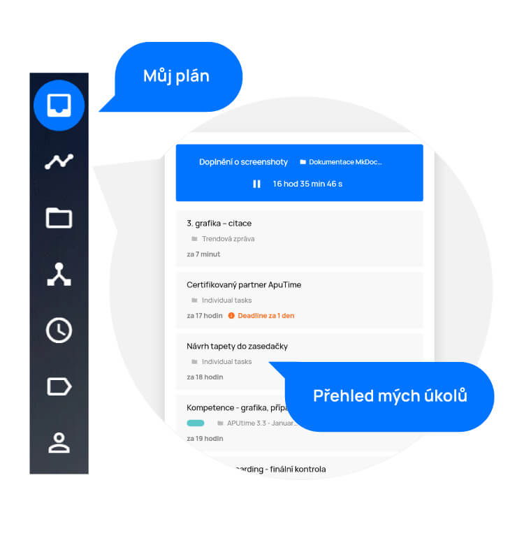
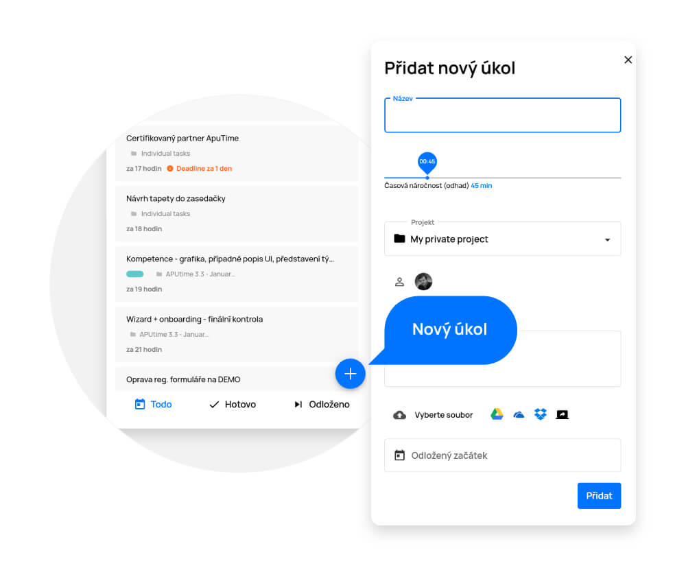
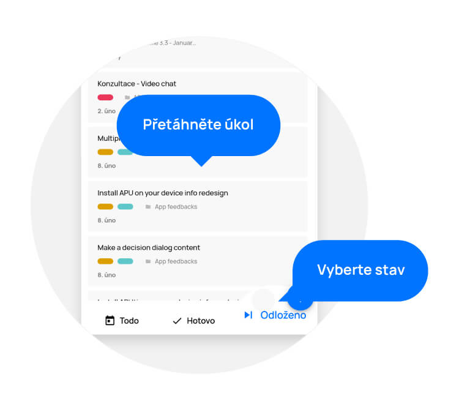

# Můj plán

> V sekci „Můj plán“ najdete všechny vaše úkoly rozdělené do několika sloupců dle jejich stavu. Každý sloupec představuje jednu z etap životnosti úkolu. Priority úkolů jsou nastaveny umělou inteligencí na základě mnoha parametrů. Zde vždy v reálném čase uvidíte vše, na čem se má pracovat a kdy.

Sekci „Můj plán“ naleznete na levém bočním menu, hned pod první ikonkou šuplíku.Po kliknutí se dostanete na přehled všech vašich úkolů.

<figure>
	<a href="../../assets/images/muj-plan.jpg" title="Můj plán" class="glightbox">
		
		<figcaption>Můj plán</figcaption>
	</a>
</figure>

## Vytvoření úkolu

Kliknutím na tlačítko „+“ v pravém dolním rohu svého plánu otevřete okno pro vytvoření nového úkolu. Úkol můžete vytvořit i v Project Formation™ a na projektu.

- V otevřeném okně vyplňte název úkolu.
- Na časové ose nastavte odhadovanou délku trvání úkolu.
- V nabídce „Projekt“ vyberte, ke kterému projektu bude úkol přiřazen.
- Nabídka řešitele zobrazuje uživatele přiřazeného k úkolu. Kliknutím na ikonu otevřete seznam uživatelů a vyberte příslušného řešitele úkolu. K úkolu je možné přiřadit i více - řešitelů. V takovém případě sjeďte až na konec seznamu a zapněte možnost „Spolupráce skupiny ve stejný čas“.
- Nabídka „Přidat štítky“ slouží k označení úkolu. Štítky slouží pro lepší přehlednost a orientaci mezi úkoly (vlastní štítky lze vytvářet a editovat v sekci „Štítky a kategorie“, kterou najdete v hlavním menu aplikace).
- Popis slouží k upřesnění zadání daného úkolu.
- Pomocí tlačítka „Vyberte soubor“ přiložíte k úkolu jakýkoliv soubor z vašeho zařízení. Také je k dispozici možnost přidání souboru z Google Drive, OneDrive či Dropbox.
- Odložený začátek slouží jako datum, od kterého se má úkol naplánovat mezi ostatní úkoly na časové ose Gantt.AI™. Pokud odložený začátek nenastavíte, úkol se naplánuje na nejbližší možnou dobu.
- Deadline slouží jako termín pro dokončení úkolu. Umělá inteligence dle něj určuje prioritu mezi ostatními úkoly.

Pro úspěšné vytvoření úkolu klikněte na tlačítko „Vytvořit“.

<figure class="large_image">
	<a href="../../assets/images/muj-plan-vytvoreni-ukolu.jpg" title="Vytvoření úkolu" class="glightbox">
		
		<figcaption>Vytvoření úkolu</figcaption>
	</a>
</figure>

### Detail úkolu

Detail úkolu otevřete kliknutím na název úkolu. Je velmi podobný nabídce, ve které úkol vytváříte. V detailu najdete všechny informace o úkolu, které také můžete rovnou upravovat.

Díky nabídce „Více“ (tři tečky v pravém horním rohu detailu) můžete otevřít úkol v novém okně, zkopírovat odkaz úkolu, zobrazit úkoly v projektu, zobrazit úkol v grafickém prostředí ProjectFormation™ nebo úkol smazat.

Na seznamu svých úkolů také můžete vidět upozornění na blížící se deadline. V případě, kdy se blíží překročení nastavené deadline, uvidíte oranžový vykřičník s upozorněním, za jak dlouho se deadline překročí. V případě, že již deadline překročena byla, uvidíte červený vykřičník s upozorněním, jak dlouho je již po deadline.

- Název úkolu a informace, kým byl vytvořen
- Štítky (které po kliknutí můžete měnit)
- Řešitel úkolu (po kliknutí na avatara řešitele máte možnost jej změnit či zapnout spolupráci skupiny ve stejný čas)
- Projekt, ke kterému je úkol přiřazen (kliknutím zobrazíte rolovací nabídku ostatních projektů, ve které můžete projekt změnit)
- Časová osa s nastavenou odhadovanou náročností (lze upravit a je viditelná jak pro řešitele úkolu tak pro koordinátory projektu a vedení).
  - Stavy úkolu:
    - „Todo“ = úkol je naplánován na časové ose Gantt.AI™
	- „Pracuji“ = na úkolu se pracuje a je spuštěna časomíra
	- „Hotovo“ = úkol je dokončen
	- „Odloženo“ = na úkolu nelze pracovat a je odložen na později
  - Popis úkolu – možnost přidání podrobného popisu
- Přílohy – možnost přiložit soubory
- Přidat požadavek (checklist), díky kterému můžete úkol rozdělit do několika kroků, které je potřeba udělat, aby byl úkol dokončen. Stačí jej napsat a klávesou „Enter“ přidat do seznamu. Smazat se dá kliknutím na tlačítko koše na pravé straně požadavku. V případě více řešitelů na úkolu jde také hned vidět, kdo jaký požadavek dokončil. Pro uzavření úkolu není nutné splnit checklist.
- Odložit slouží jako datum, od kterého se má úkol naplánovat mezi ostatní úkoly na časové ose Gantt.AI™. Pokud odložený začátek nenastavíte, úkol se naplánuje na nejbližší možnou dobu s ohledem na prioritu.
- Deadline slouží jako termín pro dokončení úkolu. Umělá Inteligence dle něj určuje prioritu mezi ostatními úkoly.
- Komentáře na úkolu od ostatních pracovníků. Pokud kdokoliv přidá komentář k úkolu, jehož jste součástí, dostanete také notifikaci.
- Historie úkolu - kliknutím na tlačítko „Zobrazit vše“ se vám ukáže historie všech akcí, které a kým byly na úkolu provedeny.
- Strávený čas (odpracovaný čas na úkolu naměřen stopkami, když je úkol ve stavu „pracuji na tom“. Zde lze také přidat vlastní časový záznam.)

Upozornění: Všechny provedené změny je vždy třeba uložit tlačítkem „Uložit“ v pravém dolním rohu.

## Změna stavu úkolu

Změnu stavu úkolu provedete jeho přetažením do odpovídajícího sloupce, popř. ji provedete přímo na detailu úkolu pomocí tlačítek „Todo, Pracuji na tom, Hotovo, Odloženo“. Vedení, koordinátoři a zakladatelé úkolů mohou měnit stavy i ostatním řešitelům úkolu. Změnu stavu lze také nastavit i hromadnou úpravou na více úkolech pomocí hromadné úpravy.

<figure>
	<a href="../../assets/images/muj-plan-zmena-stavu-ukolu.jpg" title="Změna stavu úkolu" class="glightbox">
		
		<figcaption>Změna stavu úkolu</figcaption>
	</a>
</figure>

### Zahájení práce na úkolu
Práci na úkolu zahájíte přetažením jeho dlaždice do modře ohraničené zóny nad sloupci. Po přetažení se spustí časomíra.

### Pozastavení práce na úkolu
Práci na úkolu můžete kdykoliv pozastavit přetažením dlaždice zpět do sloupce „Todo“, nebo kliknutím na tlačítko „Pauza“.

### Dokončení úkolu
Když je práce na úkolu dokončena, přetažením do sloupce „Hotovo“ úkol uzavřete.

### Odložení úkolu
Pokud na úkolu nemůžete pracovat, přetáhněte jej do pravého sloupce „Odloženo“. Po přetažení se zobrazí nabídka, ve které vyplníte důvod a dobu pro jeho odložení a potvrdíte tlačítkem „Odložit“.
