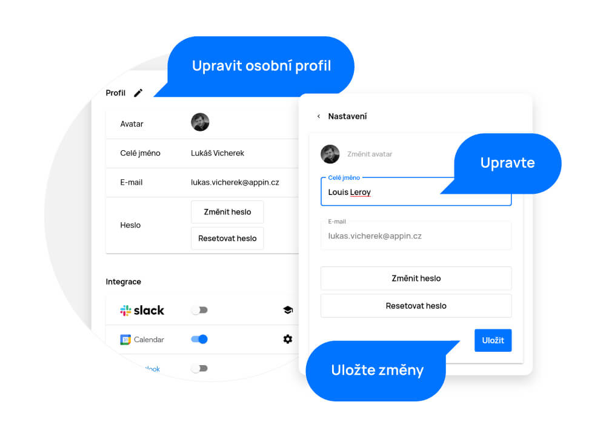

# Nastavení

> V sekci „Nastavení“ můžete upravit svůj profilový obrázek, jméno, e-mail nebo si změnit heslo. Můžete zde také nastavit veškeré integrace. Propojit APU se Slackem, Google Kalendářem, Microsoft Kalendářem nebo získat API klíč pro integraci s jinými nástroji.

Nastavení najdete po rozkliknutí svého profilu v pravém horním rohu rozbalovací nabídky pod ozubeným kolečkem.

<figure>
	<a href="../../../assets/images/nastaveni.jpg" title="Nastavení" class="glightbox">
		
		<figcaption>Nastavení</figcaption>
	</a>
</figure>

## Úprava profilu

V první části stránky nastavení můžete změnit základní údaje jako jsou profilový obrázek, jméno, e-mail nebo heslo. Stačí pouze kliknout na ikonu tužky, upravit, co je potřeba, a kliknout na tlačítko „Uložit“.

<figure>
	<a href="../../../assets/images/nastaveni-uprava-profilu.jpg" title="Úprava profilu" class="glightbox">
		
		<figcaption>Úprava profilu</figcaption>
	</a>
</figure>

## Integrace

Pokud používáte i jiné nástroje a chcete je pro usnadnění práce propojit s APU, můžete takto učinit jednoduše v této sekci nastavení.

- Slack propojíte jednoduše kliknutím na přepínací tlačítko. Budete přesměrováni na stránku Slack, kde stačí kliknout na tlačítko „Allow“ a poté přímo v Aplikaci povolit dvousměrnou integraci Slacku kliknutím na tlačítko „Je to můj požadavek“. Poté se vám APU ozve přímo do Slacku!

Dvousměrná integrace Slacku umožňuje spravovat vaše úkoly přímo skrze Slack kanál. Občas také můžeme posílat důležitá upozornění o změnách na úkolech nebo komentářích. Můžete vyvolat vlákno, díky kterému lze přímo ze Slacku např. Odpovědět na komentář vašich kolegů.

**Momentálně podporujeme tyto zkratky:**

| Zkratka                               | Popis                                    |
| ------------------------------------- | ---------------------------------------- |
| /task [?Task NAME]                  | Otevření okna pro vytvoření nového úkolu |
| /start [Task CODE]                  | Spuštění stopek                          |
| /stop                               | Zastavení stopek                         |
| /done [Task CODE]                   | Uzavření úkolu                           |
| /comment [Task CODE] [Comment]      | Přidání komentáře k úkolu                |
| /my [Any string or predicates]    | Zobrazení Mého plánu                     |
| /find [Any string or predicates] | Vyhledávání v úkolech                    |

Upozornění: Kód úkolu naleznete v URL detailu daného úkolu.

Naši integraci můžete kdykoliv vypnout v nastavení Slacku:
https://[YOUR-WORKSPACE].slack.com/apps/manage

- Google Kalendář propojíte jednoduše kliknutím na přepínací tlačítko. Budete přesměrováni na stránku Google přihlášení, kde zvolíte svůj e-mail, který chcete použít k synchronizaci. Zadáte heslo ke svému účtu a poté vyberete, které kalendáře chcete s APU synchronizovat.
- Microsoft Kalendář propojíte jednoduše kliknutím na přepínací tlačítko. Budete přesměrováni na stránku Microsoft přihlášení, kde zvolíte svůj e-mail, který chcete použít k synchronizaci. Zadáte heslo ke svému účtu a poté vyberete, co všechno z vašeho kalendáře chcete s APU propojit.

<figure>
	<a href="../../../assets/images/nastaveni-integrace.jpg" title="Integrace" class="glightbox">
		
		<figcaption>Integrace</figcaption>
	</a>
</figure>

V kalendáři poté vidí vaše akce projektoví manažeři a vedení. Pokud máte v kalendáři události, které máte označené jako „private”, jejich informace zobrazeny nebudou. Projektoví manažeři a vedení budou pouze vidět, že v daný čas máte „nějakou” událost.
