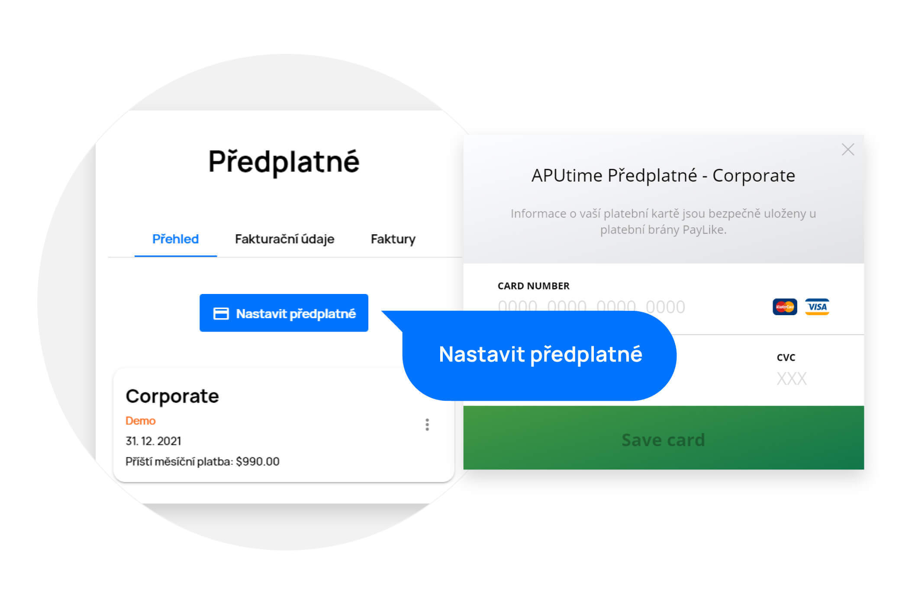
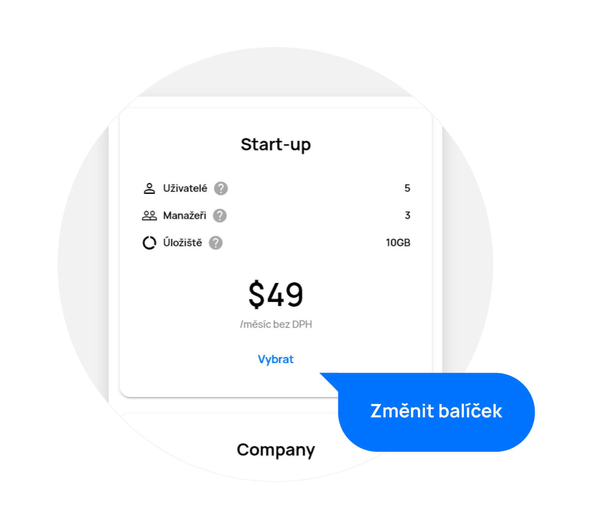

# Předplatné

> V sekci „Předplatné“ najdete kompletní přehled o vaší aktuální licenci a můžete ji spravovat. Předplatné může být nastaveno jak v měsíčních tak v ročních intervalech, při ročním intervalu však ušetříte.

Předplatné naleznete v nabídce „Předplatné“ v pravé horní části obrazovky po kliknutí na profilový obrázek.

**Upozornění**: Pro správu předplatného musíte mít přidělena práva vedení.

<figure>
	<a href="../../assets/images/preplatne.jpg" title="Předplatné" class="glightbox">
		
		<figcaption>Předplatné</figcaption>
	</a>
</figure>

## Přehled
V překledu předplatného si můžete nastavit, upravit či zkontrolovat vaše předplatné.

Předplatné si nastavíte kliknutím na tlačítko „Nastavit předplatné“. V následujícím kroku vyplňte platební údaje a potvrďte.

<figure>
	<a href="../../assets/images/predplatne-nastaveni.jpg" title="Nastavení předplatného" class="glightbox">
		
		<figcaption>Nastavení předplatného</figcaption>
	</a>
</figure>

Používáme vysoce zabezpečenou platební bránu společnosti Paylike.

Zrušit předplatné můžete kdykoliv, pokud nebudete chtít naše služby nadále využívat.

Na výběr máte ze tří balíčků, lišících se zejména velikostí firmy a úložiště. Pokud si zakoupíte menší balíček a budete do něj chtít přidat uživatele či úložiště nad rámec, můžete to udělat separátně za uvedené ceny.

Pokud například odstraníte některého z uživatelů, dostanete za něj nevyužitý kredit, který se vám automaticky převede do následující platby.

Balíček můžete také kdykoliv navýšit dle vašich potřeb.

<figure>
	<a href="../../assets/images/predplatne-zmena-balicku.jpg" title="Výběr balíčku" class="glightbox">
		
		<figcaption>Výběr balíčku</figcaption>
	</a>
</figure>

## Fakturační údaje
Zde je potřeba mít vyplněny vaše fakturační údaje, abychom mohli vystavovat faktury. Se všemi údaji samozřejmě nakládáme dle podmínek zpracování osobních údajů.

## Faktury
V této části naleznete přehled všech faktur, které jsme vám vystavili. Jednoduše si je můžete stáhnout či zobrazit.