# ProjectFormation™

> V tomto grafickém nástroji se vizualizují procesy jednotlivých projektů. Díky rozkreslení každého projektu naše umělá inteligence optimalizuje harmonogram a postará se o hladký chod práce. Záznamy z ProjectFormation™ si můžete také vytisknout.

ProjectFormation™ naleznete na levém bočním menu, pod ikonkou rozhodovacího prvku. Po kliknutí se dostanete do grafického rozhraní.

## Vytvoření šablony procesu

V případě, že nemáte rozpracovanou žádnou mapu, zobrazí se vám okno pro vytvoření nové mapy. V něm vyplňte název mapy a klikněte na tlačítko „Začít kreslit“.

Pokud máte mapu rozpracovanou a chcete ji z nějakého důvodu smazat a začít kreslit novou, klikněte na její název (první ikona ProjectFormation™ v panelu ovládacích prvků v pravém horním okně) a vyberte možnost „Nakreslit novou“, popř. ji můžete jen přejmenovat a pokračovat v kreslení.

<figure>
	<a href="../../../assets/images/cs/projectformation-vytvoreni-sablony-procesu.jpg" title="Vytvoření šablony procesu" class="glightbox">
		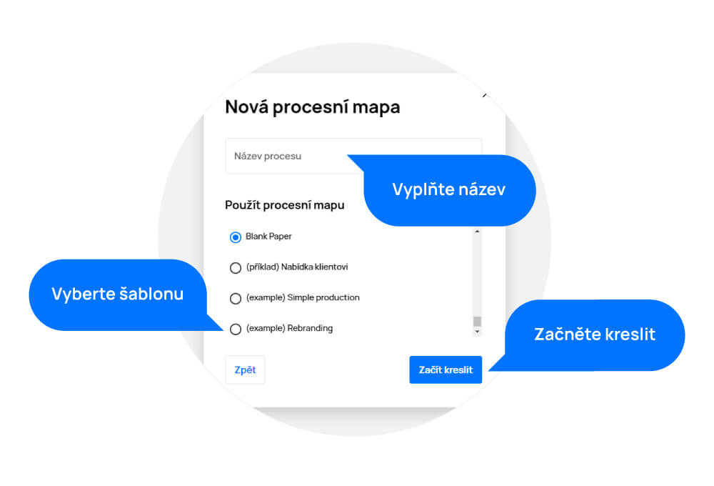
		<figcaption>Vytvoření šablony procesu</figcaption>
	</a>
</figure>

## Přidání úkolu v ProjectFormation™

V dalším kroku je potřeba přidat úkoly do procesní mapy.

Nový úkol přidáte tlačítkem „+“ v pravém dolním rohu (okno pro přidání a nastavení úplně prvního úkolu se zobrazí automaticky). Úkol můžete vytvořit i v projektu a v sekci „Můj Plán“.

- Vyplňte název úkolu
- Na časové ose nastavte odhadovaný čas délky úkolu (výchozí nastavení je 45 minut)
- Vyberte řešitele (ikona panáčka). Výchozím nastavením je úkol přiřazen tvůrci procesní mapy.
- Štítkem můžete úkol označit pro lepší přehlednost a orientaci mezi ostatními úkoly.
- V poli „Popis“ můžete přidat podrobnější informace k úkolu.
- Nabídka „Přidat požadavek“ umožňuje vytvoření seznamu menších podúkolů (kroků), které mají být v rámci úkolu splněny.
- Možnost přidání aktuálního uživatele jako řešitele (užitečné např. když má být tvůrce projektu zároveň řešitelem).
- Nastavení relativní deadline nastaví úkolu deadline automaticky na určitou dobu od data vytvoření. Kdykoliv tedy vytvoříte procesní mapu z dané šablony, deadline se naplánuje na vámi zvolenou dobu (např. + 2 týdny od vytvoření projektu).

Všechny tyto kroky můžete také upravit, nebo nastavit později v detailu úkolu.

Nastavený úkol uložíte tlačítkem „Přidat úkol“.

Vytvořený úkol se zobrazí jako dlaždice v prostředí ProjectFormation™, ke kterému můžete přidávat další úkoly procesu a tvořit návaznosti mezi nimi v rámci projektu.

<figure>
	<a href="../../../assets/images/cs/projectformation-pridani-ukolu.jpg" title="Přidání úkolu v ProjectFormation™" class="glightbox">
		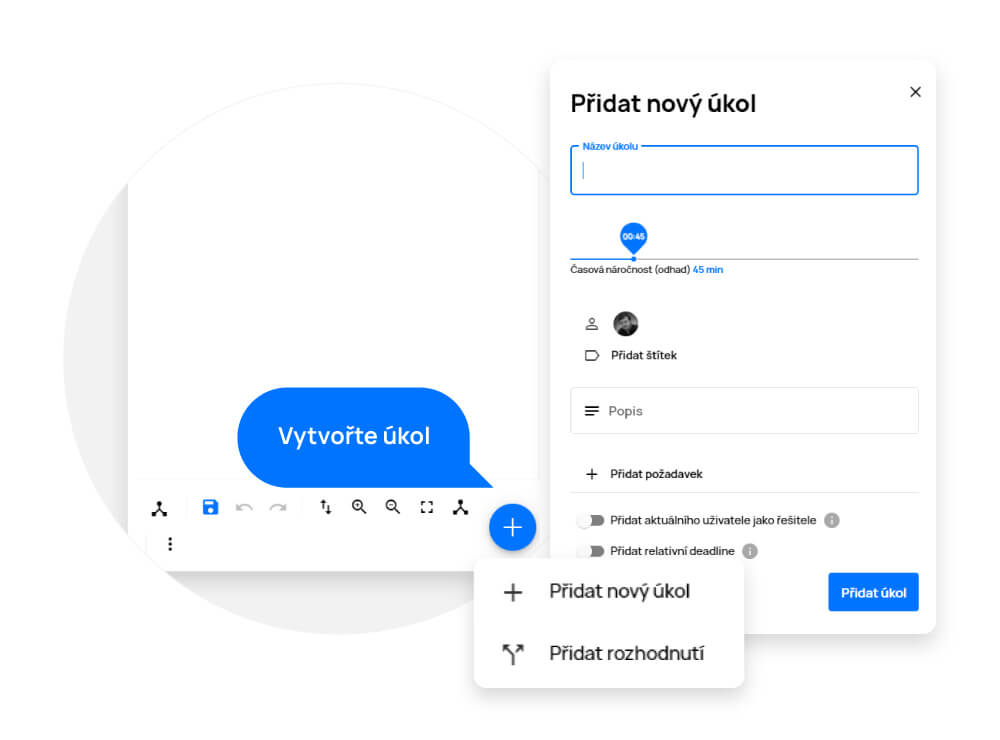
		<figcaption>Přidání úkolu v ProjectFormation™</figcaption>
	</a>
</figure>

## Automatické umístění

Na plovoucí liště také naleznete tlačítko „Automatické umístění“. To se hodí, když chcete dát mapě procesu po jejím nakreslení řád. Po kliknutí na toto tlačítko se vám mapa procesu sama rozestaví tak, aby byla přehledná a šly dobře vidět veškeré posloupnosti a návaznosti.

<figure>
	<a href="../../../assets/images/cs/projectformation-automaticke-umisteni.jpg" title="Automatické umístění" class="glightbox">
		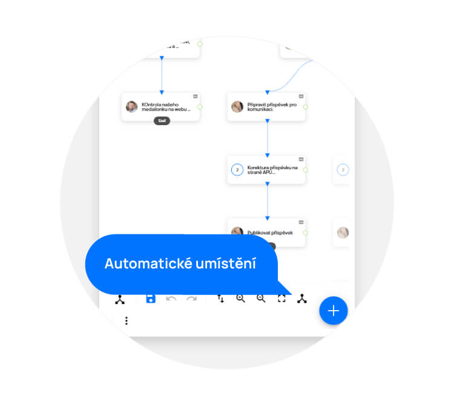
		<figcaption>Automatické umístění</figcaption>
	</a>
</figure>

## Import šablony procesu
Pokud již máte nějakou procesní mapu uloženou ve svém PC, můžete ji jednoduše importovat pomocí tlačítka „Importovat”, které naleznete v plovoucí liště v pravém horním rohu po kliknutí na „Více“ (tři tečky).

<figure>
	<a href="../../../assets/images/cs/projectformation-import-sablony-procesu.jpg" title="Import šablony procesu" class="glightbox">
		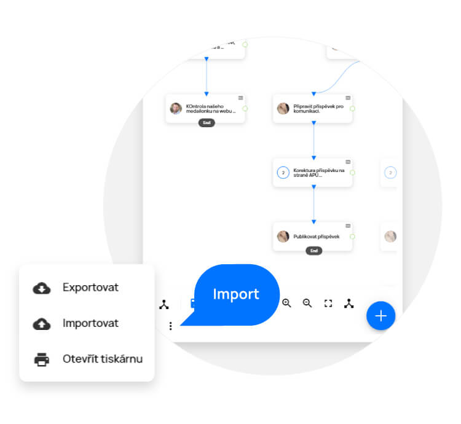
		<figcaption>Import šablony procesu</figcaption>
	</a>
</figure>

## Export šablony procesu
Pokud chcete procesní mapu exportovat (stáhnout), stačí použít tlačítko „Exportovat”, které naleznete v plovoucí liště v pravém horním rohu po kliknutí na „Více“ (tři tečky). Poté se vám procesní mapa stáhne ve formátu .json a vy si ji můžete uložit nebo třeba poslat.

<figure>
	<a href="../../../assets/images/cs/projectformation-export-sablony-procesu.jpg" title="Export šablony procesu" class="glightbox">
		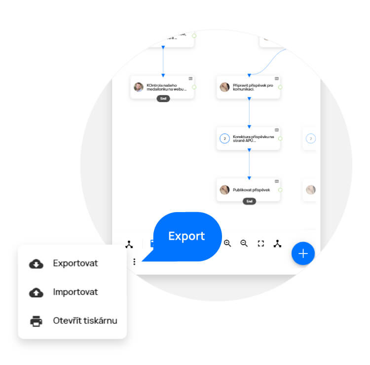
		<figcaption>Export šablony procesu</figcaption>
	</a>
</figure>

## Tisk šablony procesu
Mapu procesu si můžete jednoduše vytisknout pomocí tlačítka „Otevřít tiskárnu”, které naleznete v plovoucí liště v pravém horním rohu po kliknutí na „Více“ (tři tečky). Poté se vám šablona vaší mapy procesu otevře v novém okně v tiskové kvalitě a vy pouze kliknete pravým tlačítkem kdekoliv v okně a vyberete možnost „Tisk“.

<figure>
	<a href="../../../assets/images/cs/projectformation-tisk-sablony-procesu.jpg" title="Tisk šablony procesu" class="glightbox">
		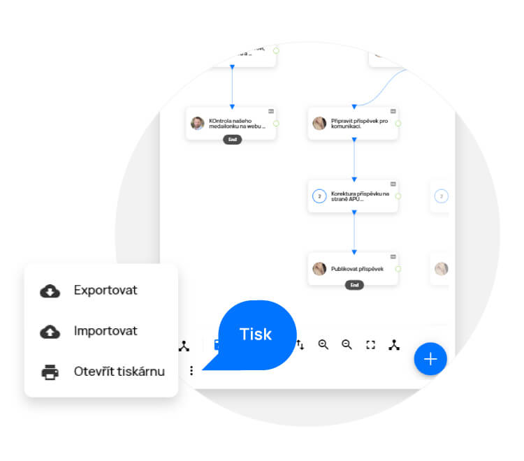
		<figcaption>Tisk šablony procesu</figcaption>
	</a>
</figure>

## Úprava úkolu v ProjectFormation™
Dlouhým kliknutím (nebo dvojklikem) na dlaždici otevřete nastavení úkolu pro editaci.
Zde můžete upravit informace o úkolu stejným způsobem, jako byste tvořili nový úkol.

<figure>
	<a href="../../../assets/images/cs/projectformation-uprava-ukolu.jpg" title="Úprava úkolu v ProjectFormation™" class="glightbox">
		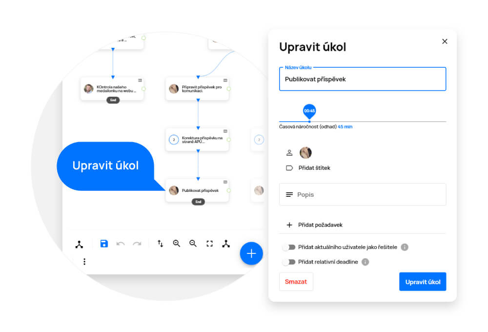
		<figcaption>Úprava úkolu v ProjectFormation™</figcaption>
	</a>
</figure>

## Propojení úkolů v ProjectFormation™
Pokud projekt obsahuje více úkolů, můžete je propojit kliknutím a tažením z bodu „End“ na dlaždici úkolu A do bodu „Start“ úkolu B (toto pak v projektu znamená, že musí být úkol A dokončen, aby se mohlo začít pracovat na úkolu B).

<figure>
	<a href="../../../assets/images/cs/projectformation-propojeni-ukolu.jpg" title="Propojení úkolů v ProjectFormation™" class="glightbox">
		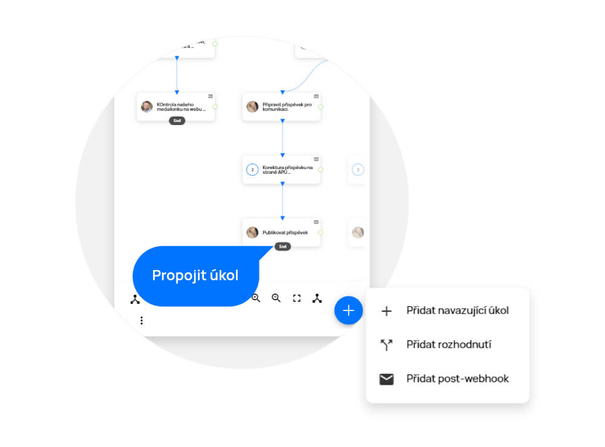
		<figcaption>Propojení úkolů v ProjectFormation™</figcaption>
	</a>
</figure>

## Přidání úkolu s návazností v ProjectFormation™
Můžete také rovnou přidat nový úkol s návazností na již vytvořený úkol.

- Kliknutím na bod Start přidáte úkol s návazností před (tzn., že nově přidaný úkol bude bude tomu stávajícímu předcházet).
- Kliknutím na bod End přidáte úkol s návazností po (tzn., že nově přidaný úkol bude na stávající úkol navazovat).

Návaznosti smažete najetím kurzorem na čáru propojení a kliknutím na křížek.

## Pipelines v ProjectFormation™
Nastavení pipelines mezi dvěma úkoly způsobí, že po dokončení 1. úkolu, se 2. úkolu automaticky nastaví odložený začátek (kdy se má začít plánovat v Gantt.AI™) nebo deadline, kterou jste nastavili.

Na pravé straně dlaždice úkolu klikněte na zelený kroužek a tažením ho propojte s úkolem, kterému potřebujete nastavit pipeline

Ve vyskakovacím okně je možné nastavit následující údaje:
- Odložený začátek – kdy se má úkol začít plánovat po uzavření zdrojového úkolu
- Deadline – termín, do kterého má být úkol hotov (deadline není nutné nastavovat).

Pipeline poté uložíte tlačítkem „Nastavit pipeline“.

<figure>
	<a href="../../../assets/images/cs/projectformation-nastaveni-pipeline.jpg" title="Pipelines v ProjectFormation™" class="glightbox">
		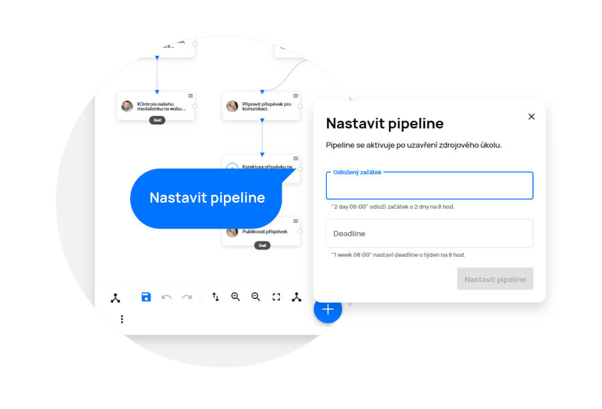
		<figcaption>Pipelines v ProjectFormation™</figcaption>
	</a>
</figure>

## Rozhodovací prvek v ProjectFormation™
Díky rozhodovacímu prvku máte možnost po dokončení úkolu v projektu rozhodnout, kterou cestou bude proces nadále pokračovat. To znamená, že úkoly následující po rozhodovacím prvku se v projektu vytvoří až po učinění konkrétního rozhodnutí.

Rozhodovací prvek přidáte kliknutím na ikonu „Přidat rozhodnutí“.

Vyplňte rozhodující otázku, na kterou lze odpovědět pouze ANO/NE a klikněte na „Přidat rozhodnutí“.

Návaznosti a propojení zde fungují stejně jako u úkolů.

Úkoly a rozhodovací prvky můžete libovolně přesouvat (kliknutím a tažením) na pracovním plátně.

<figure>
	<a href="../../../assets/images/cs/projectformation-rozhodovaci-prvek.jpg" title="Rozhodovací prvek v ProjectFormation™" class="glightbox">
		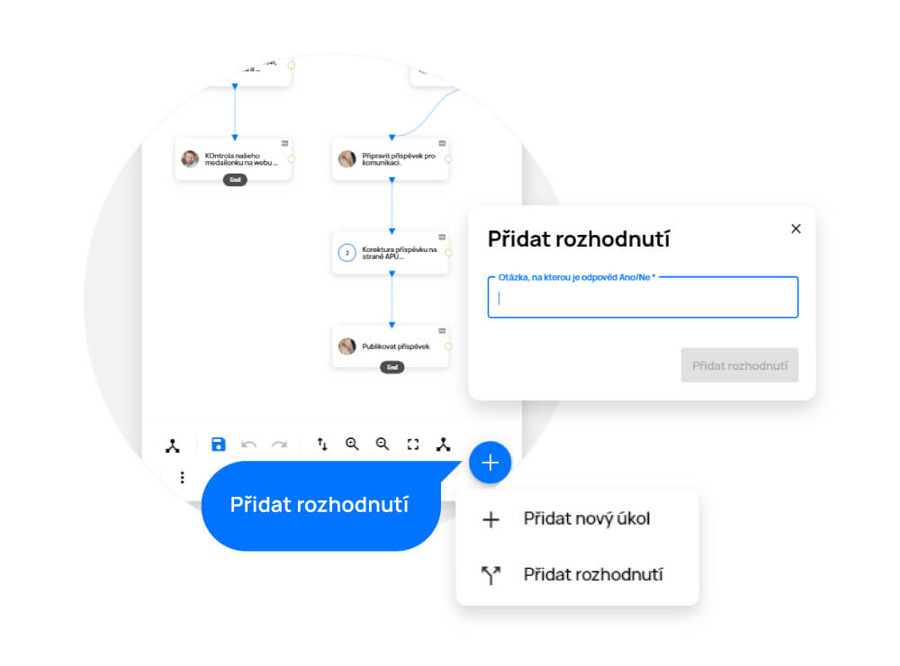
		<figcaption>Rozhodovací prvek v ProjectFormation™</figcaption>
	</a>
</figure>

## Paralelní úkoly za rozhodujícím prvkem
Pokud potřebujete za rozhodovací prvek vložit paralelně více úkolů, musíte využít úkol bez řešitele, který bude sloužit jako rozdělovač (uzavře se sám automaticky, jakmile na něj dojde v procesu řada) a za něj pak tyto úkoly zařadíte.

Každou procesní mapu uložíte kliknutím na ikonu „Uložit mapu“ (modrá disketa) v ovládacích prvcích.

Uložit procesní mapu lze také více způsoby.

- „Vytvořit nový projekt z myšlenkové mapy“ = vytvoří se nový projekt s úkoly pro danou mapu.
- „Uložit do existujícího projektu“ = mapa s úkoly se uloží do již existujícího projektu, který může obsahovat jiné úkoly.
- „Uložit jako šablonu“ = uloží mapu pro pozdější použití.

<figure>
	<a href="../../../assets/images/cs/projectformation-rozdelovac.jpg" title="Paralelní úkoly za rozhodujícím prvkem" class="glightbox">
		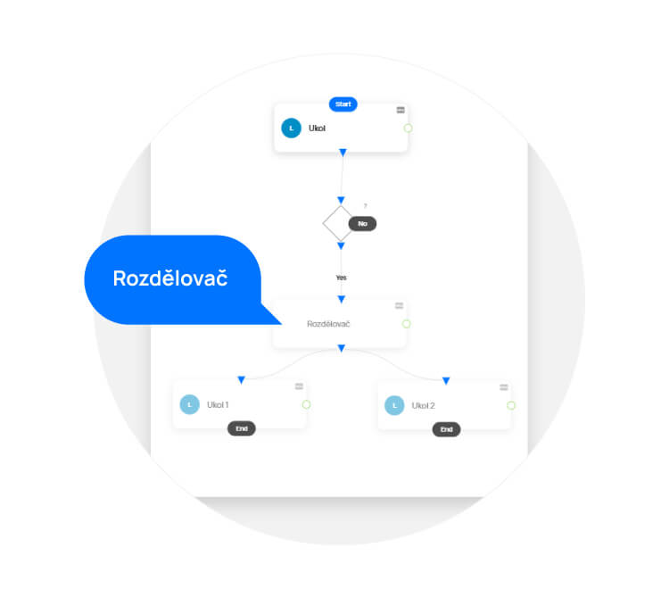
		<figcaption>Paralelní úkoly za rozhodujícím prvkem</figcaption>
	</a>
</figure>

## Pohybování se v ProjectFormation™

**Klávesové zkratky a gesta pro pohodlné ovládání ProjectFormation™.**

| Zkratka                               | Popis                                    |
| ------------------------------------- | ---------------------------------------- |
| T                   | Přidání úkolu  |
| D                   | Přidání rozhodovacího prvku  |
| R                   | Automatické rozmístění  |
| S                   | Uložení šablony  |
| Delete                   | Smazání vybraných prvků  |
| Ctrl/Cmd + Z                   | Zpět  |
| Ctrl/Cmd + Shift + Z                   | Znovu  |
| Dvojklik                   | Úprava prvku  |
| Klik prvým tl. myši na prvek/vybrané prvky | Otevření nabídky úprav  |
| Klik prvým tl. myši do volného prostoru  | Otevření nabídky vytvoření úkolu/rozhodnutí/podprocesu   |

**Pohyb a Zobrazení**

| Zkratka                               | Popis                                    |
| ------------------------------------- | ---------------------------------------- |
| A  | Zobrazení celé mapy (přizpůsobení na velikost obrazovky)  |
| Šipky  | Pohyb do stran  |
| Cmd/Ctrl + scroll  | Přiblížení/oddálení na dané místo  |
| Scroll  | Pohyb po plátně  |
| Alt+Scroll  | Pohyb nahoru/dolů  |
| Shift + Scroll  | Pohyb doprava/doleva  |
| Pohyb dvěma prsty  | Pohyb po plátně  |
| Pohyb dvěma prsty od sebe/k sobě  | Přiblížení/oddálení mapy na dané místo  |

**Výběr prvků**

| Zkratka                               | Popis                                    |
| ------------------------------------- | ---------------------------------------- |
| Alt + Přetažení myší  | Nový výběr  |
| Cmd/Ctrl + Výběr myší  | Přidat/Odebrat z výběru  |
