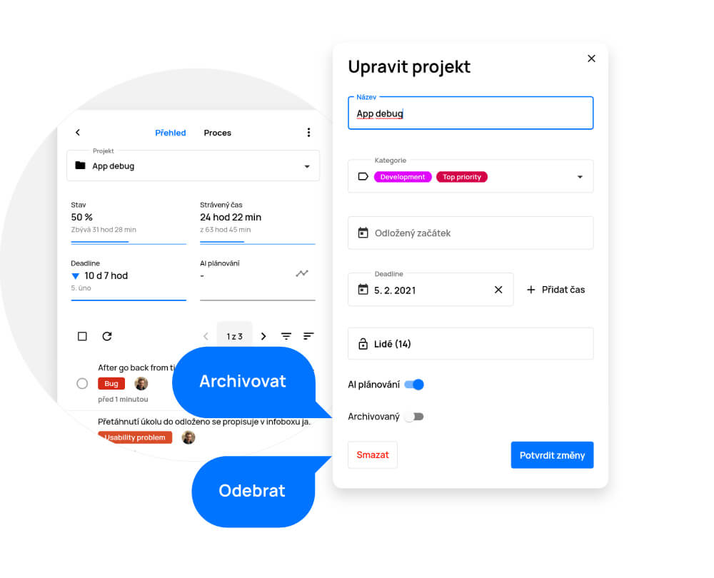
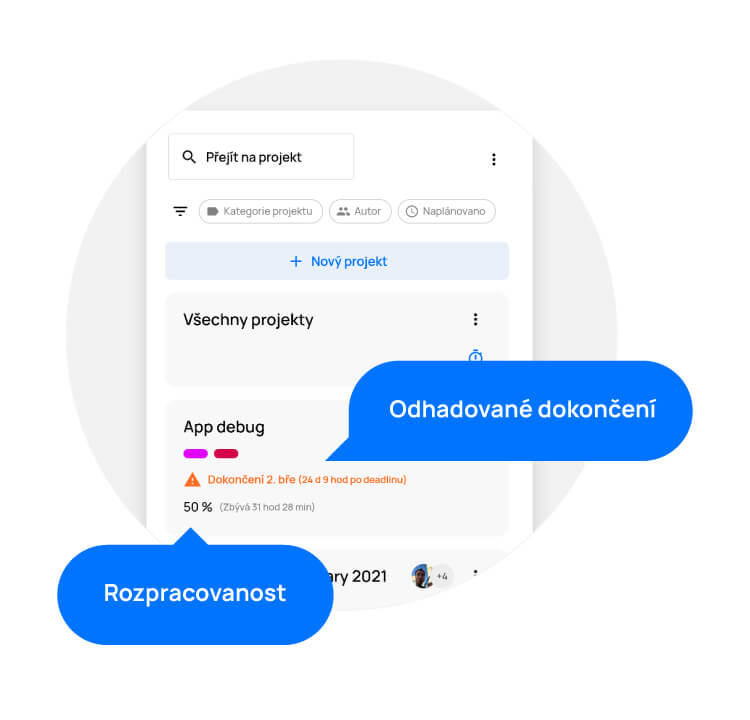
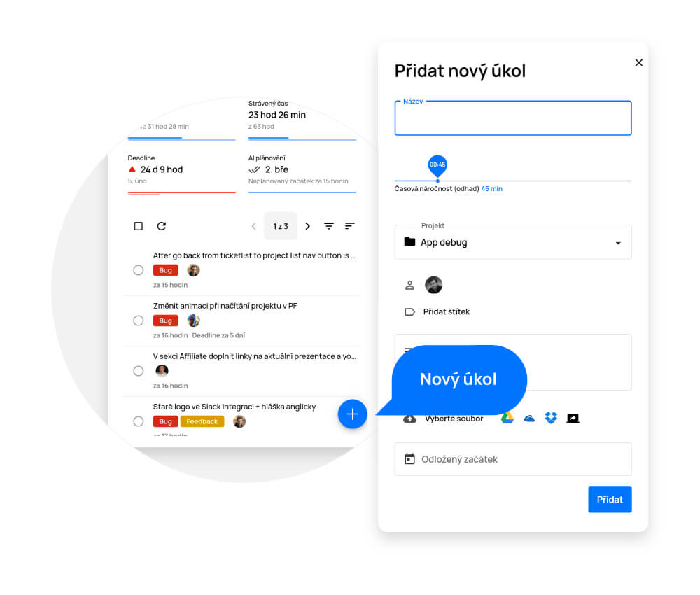
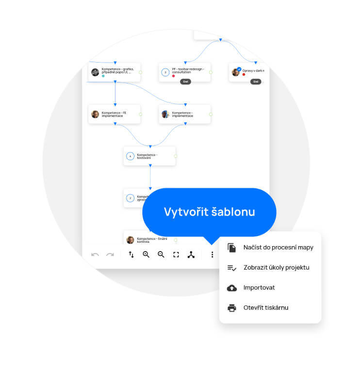

# Projekty

> V této sekci naleznete přehled všech projektů, ke kterým máte přístup, seřazený dle jejich aktuální priority. Jako první vidíte projekty, které vyžadují vaši pozornost např. z důvodu překročení termínu dokončení. Také na nich rovnou můžete vidět, z kolika procent je projekt dokončen a do jaké kategorie daný projekt spadá.

Sekci „Projekty“ naleznete na levém bočním menu, pod ikonkou složky. Po kliknutí se dostanete na přehled všech projektů ve firmě.

<figure>
	<a href="../../../assets/images/projekty.jpg" title="Projekty" class="glightbox">
		
		<figcaption>Projekty</figcaption>
	</a>
</figure>

## Vytvoření projektu

- Tlačítkem „+“ v pravém dolním rohu otevřete nabídku pro vytvoření nového projektu.
- V nabídce „Nový projekt“ vyplňte název projektu.
- Přiřaďte projekt do kategorie. Díky tomu budete moci takto označené projekty jednoduše filtrovat.
- Nastavte termín pro jeho dokončení (toto je důležitý krok, protože termín dokončení určuje prioritu mezi ostatními projekty v plánování na časové ose Gantt.AI™)
- Můžete zde také nastavit odložený začátek (datum, od kterého se má začít projekt plánovat).
- Tlačítkem „Lidé“ zobrazíte podnabídku, ve které můžete určit, kteří uživatelé mají do tohoto projektu přístup.
- Jakmile je uživatel k projektu přiřazen, má výchozí přidělenou roli (práva) v daném projektu.
- Přiřazenou roli můžete změnit kliknutím na nabídku a následně výběrem ze tří možností (Správce, Účastník, Účastník s omezením).

Projekt vytvoříte kliknutím na tlačítko „Vytvořit“.

<figure>
	<a href="../../../assets/images/projekty-vytvoreni-projektu.jpg" title="Vytvoření projektu" class="glightbox">
		
		<figcaption>Vytvoření projektu</figcaption>
	</a>
</figure>

## Úprava projektu

Upravit projekt je možné dvěma způsoby:

1. V sekci „Projekty“ na dlaždici projektu klikněte na tlačítko „Více“ (tři tečky) a vyberte „Upravit“
2. V detailu projektu (otevřeném projektu) klikněte na ikonu tužky vpravo nahoře.

Provedené změny vždy uložte tlačítkem „Potvrdit změny“.

Pokud chcete projekt odstranit, na dlaždici projektu vyberte „Více“ (tři tečky) a klikněte na „Upravit“. V levém dolním rohu tabulky naleznete možnost „Smazat“. Po kliknutí bude projekt odstraněn.

<figure>
	<a href="../../../assets/images/projekty-uprava-projektu.jpg" title="Úprava projektu" class="glightbox">
		
		<figcaption>Úprava projektu</figcaption>
	</a>
</figure>

## Archivace/Odstranění projektu

### Koš
Pokud chcete projekt odstranit úplně i se všemi jeho daty, na dlaždici projektu klikněte na tlačítko „Více“ (tři tečky) a vyberte „Upravit“. Na konci plovoucího okna vidíte po levé straně tlačítko „Smazat“. Projekt bude smazán ale po dobu 14 dnů ještě zůstane v koši, kdybyste jej náhodou potřebovali obnovit.

### Archiv
Pokud chcete projekt archivovat i se všemi jeho daty, na dlaždici projektu klikněte na tlačítko „Více“ (tři tečky) a vyberte  „Upravit“. V dolní části plovoucího okna vidíte přepínací tlačítko, pomocí kterého projekt můžete archivovat. Kdykoliv budete potřebovat projekt a jeho úkoly znovu zobrazit, stačí na seznamu projektů kliknout na tlačítko „Více“ (tři tečky) a vybrat „Archivované“, kde se vám zobrazí seznam všech projektů, které kdy byly archivovány. Pokud budete chtít projekt obnovit, stačí na detailu projektu přesunout volbu na přepínacím tlačítku.

<figure>
	<a href="../../../assets/images/projekty-archivace-odstraneni-projektu.jpg" title="Archivace/Odstranění projektu" class="glightbox">
		
		<figcaption>Archivace/Odstranění projektu</figcaption>
	</a>
</figure>

## Dlaždice projektu

Na dlaždici každého projektu vidíte důležité informace – v jakém stavu se projekt nachází (procentuální hodnotu dokončení) a plánovaný termín jeho dokončení. Pulzující ikona stopek symbolizuje, že se na některém z úkolů projektu právě pracuje. Kliknutím na dlaždici projektu zobrazíte jeho detail.

Kliknutím na tlačítko „Více“ (tři tečky) otevřete nabídku, kde můžete projekt upravit, podívat se na strávený čas (zjistit kolik času bylo odpracováno na celém projektu či na jednotlivých úkolech), nebo zobrazit jeho proces v ProjectFormation™.

<figure>
	<a href="../../../assets/images/projekty-dlazdice-projektu.jpg" title="Dlaždice projektu" class="glightbox">
		
		<figcaption>Dlaždice projektu</figcaption>
	</a>
</figure>

## Detail projektu

Do detailu projektu se dostanete kliknutím na dlaždici vybraného projektu v sekci Projekty.

V tomto detailu najdete přehledné informace o projektu, včetně kompletního seznamu úkolů. Zde také můžete úkoly přidávat i upravovat.

Pomocí rolovací nabídky, v levém horním rohu, se můžete jednoduše přepínat mezi ostatními projekty, které chcete zobrazit.

- Editování projektu – kliknutím na ikonu tužky, otevřete podrobnosti o projektu, které můžete editovat.
- Soubory – Po rozkliknutí záložky soubory se dostanete ke kompletnímu seznamu všech souborů které se při práci na projektu použily.
- Zobrazení v ProjectFormation™ – kliknutím na záložku „Proces“, otevřete projekt v grafickém zobrazení přímo v nástroji ProjectFormation™, ve kterém můžete upravovat procesy - projektu. Zpět na přehled projektu se vrátíte kliknutím na záložku „Přehled“
- Filtry – filtrování úkolů podle jejich parametrů (např. dle řešitele, autora, stavu apod.)
- Seznam úkolů – přehled všech úkolů přiřazených k projektu
- Detail úkolu – kliknutím na úkol otevřete jeho detail (zobrazí se veškeré informace úkolu s možností jejich úpravy)

<figure>
	<a href="../../../assets/images/projekty-detail-projektu.jpg" title="Detail projektu" class="glightbox">
		
		<figcaption>Detail projektu</figcaption>
	</a>
</figure>

## Rozhodnutí v projektu

Pokud je třeba u projektu provést v průběhu procesu rozhodnutí, projektovému koordinátorovi se na dlaždici projektu a v detailu projektu zobrazí upozornění.

Kliknutím na tlačítko otevřete nabídku rozhodnutí. Na základě vašeho rozhodnutí se pak naplánují další úkoly.

Připomenutí o čekajícím rozhodnutí v projektu obdržíte vždy také na e-mail.

<figure>
	<a href="../../../assets/images/projekty-rozhodnuti-v-projektu.jpg" title="Rozhodnutí v projektu" class="glightbox">
		
		<figcaption>Rozhodnutí v projektu</figcaption>
	</a>
</figure>

## Vytvoření úkolu v projektu
Kliknutím na tlačítko „+“ v pravém dolním rohu projektu otevřete nabídku pro vytvoření nového úkolu. Úkol můžete vždy vytvořit také v Project Formation™ a v sekci „Můj Plán“.

<figure>
	<a href="../../../assets/images/projekty-vytvoreni-ukolu-v-projektu.jpg" title="Vytvoření úkolu v projektu" class="glightbox">
		
		<figcaption>Vytvoření úkolu v projektu</figcaption>
	</a>
</figure>

## Seznam úkolů v projektu
Seznam úkolů v projektu zobrazíte otevřením projektu (kliknutím na dlaždici) v sekci „Projekty“.

Úkoly v seznamu můžete jednoduše vyhledávat pomocí filtrů (štítek úkolu, kategorie úkolu, řešitel, typ úkolu, čas, stav a autor).

**Náhled úkolu obsahuje:**

- Stav (kolečko na začátku řádku)
	- modrý = na úkolu se může pracovat,
	- šedý = úkol čeká na návaznosti (dokončení předchozího úkolu) nebo nejste jeho řešitelem.
- Název úkolu
- Řešitele úkolu
- Dobu, za kterou má úkol plánovaný začátek
- Upozornění na blížící se deadline. V případě, kdy se blíží překročení nastavené deadline, uvidíte oranžový vykřičník s upozorněním, za jak dlouho se deadline překročí. V případě, že již deadline překročena byla, uvidíte červený vykřičník s upozorněním, jak dlouho je již po deadline.

<figure>
	<a href="../../../assets/images/projekty-seznam-ukolu-v-projektu.jpg" title="Seznam úkolů v projektu" class="glightbox">
		
		<figcaption>Seznam úkolů v projektu</figcaption>
	</a>
</figure>

## Hromadná úprava úkolů

Umožňuje rychlé úpravy (přesunutí do jiného projektu, označení štítky, změna řešitele, editace stavu) úkolů přímo v seznamu

- Kliknutím a podržením řádku úkolu jej označte (další úkoly můžete rychle označovat zaškrtnutím pole na začátku řádku).
- Po označení klikněte na tlačítko „Upravit“, které se objeví na začátku seznamu a z otevřené nabídky zvolte požadované úpravy.
- Provedené změny uložte tlačítkem „Uložit“.

Upozornění: Všechny provedené změny je vždy třeba uložit tlačítkem diskety v pravém dolním rohu.

<figure>
	<a href="../../../assets/images/projekty-hromadna-uprava-ukolu.jpg" title="Hromadná úprava úkolů" class="glightbox">
		
		<figcaption>Hromadná úprava úkolů</figcaption>
	</a>
</figure>

## Vytvoření šablony z existujícího projektu

Z vytvořeného projektu můžete vytvořit šablonu procesní mapy jejím duplikováním (stávající proces v projektu se zanechá beze změn).

- Projekt zobrazte v ProjectFormation™ – na dlaždici projektu klikněte na ikonu „Více“ (tři tečky) a zvolte možnost „Zobrazit v ProjectFormation™“ nebo můžete přímo na detailu projektu kliknout vpravo nahoře na ikonu procesu a taktéž zvolit „Zobrazit v ProjectFormation™“.
- Po otevření procesu v grafickém rozhraní klikněte v ovládacím panelu na ikonu „Více“  (tři tečky) a vyberte „Načíst do procesní mapy“.
- Nyní můžete procesní mapu libovolně upravovat, či jen uložit jako šablonu.

V ovládacích prvcích nakonec vyberte tlačítko diskety a zvolte možnost, jak chcete mapu uložit.

<figure>
	<a href="../../../assets/images/projekty-vytvoreni-sablony.jpg" title="Vytvoření šablony z existujícího projektu" class="glightbox">
		
		<figcaption>Vytvoření šablony z existujícího projektu</figcaption>
	</a>
</figure>

## Import mapy procesu
Pokud již máte nějakou procesní mapu uloženou ve svém PC, můžete ji jednoduše importovat pomocí tlačítka „Importovat”, které naleznete v plovoucí liště v pravém horním rohu po kliknutí na „Více“ (tři tečky).

<figure>
	<a href="../../../assets/images/projekty-import-mapy-procesu.jpg" title="Import mapy procesu" class="glightbox">
		
		<figcaption>Import mapy procesu</figcaption>
	</a>
</figure>

## Export mapy procesu
Pokud chcete procesní mapu exportovat (stáhnout), stačí použít tlačítko „Exportovat”, které naleznete v plovoucí liště v pravém horním rohu po kliknutí na „Více“ (tři tečky). Poté se vám procesní mapa stáhne ve formátu .json a vy si ji můžete uložit nebo třeba poslat.

<figure>
	<a href="../../../assets/images/projekty-export-mapy-procesu.jpg" title="Export mapy procesu" class="glightbox">
		
		<figcaption>Export mapy procesu</figcaption>
	</a>
</figure>

## Tisk mapy procesu
Mapu procesu si můžete jednoduše vytisknout pomocí tlačítka „Otevřít tiskárnu”, které naleznete v plovoucí liště v pravém horním rohu po kliknutí na „Více“ (tři tečky). Poté se vám vaše mapa procesu otevře v novém okně v tiskové kvalitě a vy pouze kliknete pravým tlačítkem kdekoliv v okně a vyberete možnost „Tisk“.

<figure>
	<a href="../../../assets/images/projekty-tisk-mapy-procesu.jpg" title="Tisk mapy procesu" class="glightbox">
		
		<figcaption>Tisk mapy procesu</figcaption>
	</a>
</figure>