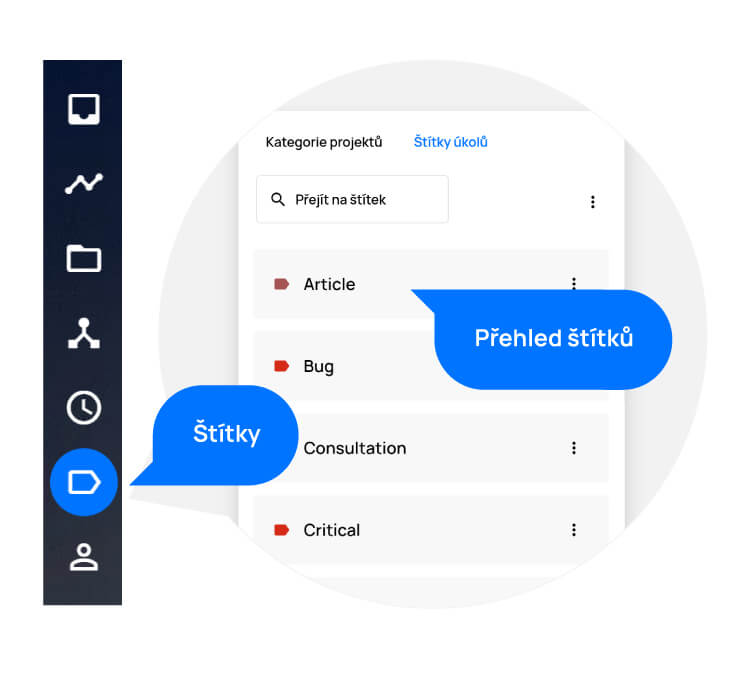
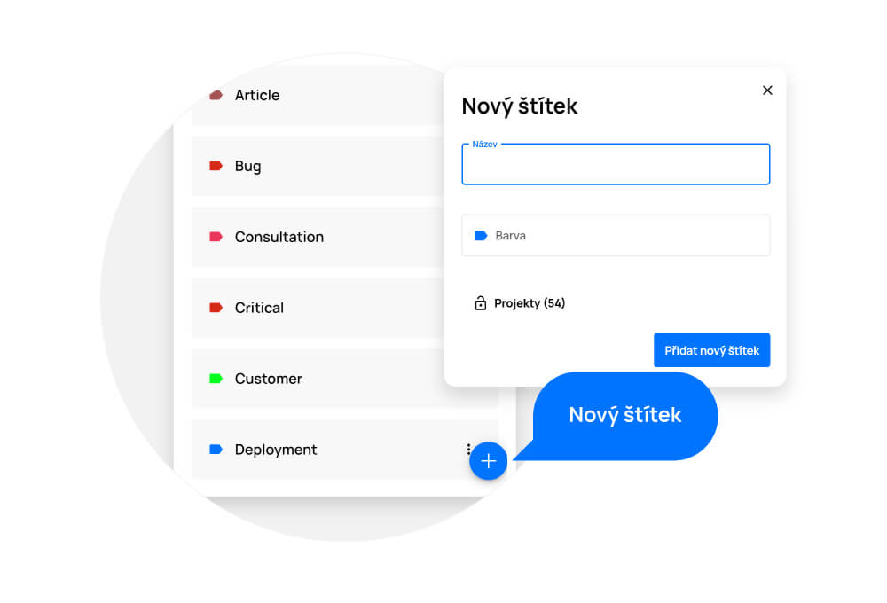

# Štítky a kategorie

> Štítky a kategorie slouží k označení úkolů a projektů pro lepší orientaci a přehlednost. Pokud budete úkoly těmito štítky označovat, můžete je pomocí nich filtrovat. Stejně tak budete mít v projektech lepší přehled, pokud je budete kategorizovat (např. mohou být pomocí kategorií odlišena jednotlivá oddělení).

<figure>
	<a href="../../assets/images/stitky-a-kategorie.jpg" title="Štítky a kategorie" class="glightbox">
		
		<figcaption>Štítky a kategorie</figcaption>
	</a>
</figure>

## Přidání štítku a kategorie

- Zvolte v levém horním rohu prostředí, zda chcete spravovat kategorie nebo štítky.
- Klikněte na tlačítko „+“ v pravém dolním rohu.
- V otevřeném okně vyplňte název štítku či kategorie.
- Po kliknutí na pole „Barva“ vyberte požadovanou barvu štítku či kategorie.
- Pro uložení klikněte na tlačítko „Přidat nový štítek/kategorii“.

<figure class="large_image">
	<a href="../../assets/images/stitky-a-kategorie-pridani-stitku.jpg" title="Přidání štítku a kategorie" class="glightbox">
		
		<figcaption>Přidání štítku a kategorie</figcaption>
	</a>
</figure>

## Úprava štítku a kategorie
Pokud chcete štítek či kategorii upravit, klikněte na nabídku „Více“ (tři tečky u štítku/kategorie), klikněte na možnost „Upravit“ a poté je upravte.

Provedené změny uložte tlačítkem „Potvrdit změny“.

<figure class="large_image">
	<a href="../../assets/images/stitky-a-kategorie-uprava-stitku.jpg" title="Úprava štítku a kategorie" class="glightbox">
		
		<figcaption>Úprava štítku a kategorie</figcaption>
	</a>
</figure>

## Odstranění štítku a kategorie
Pokud chcete štítek či kategorii odstranit, klikněte na nabídku „Více“ (tři tečky u štítku/kategorie), klikněte na možnost „Upravit“ a poté na tlačítko „Smazat“.

Provedené změny uložte tlačítkem „Potvrdit změny“.

<figure class="large_image">
	<a href="../../assets/images/stitky-a-kategorie-odstraneni-stitku.jpg" title="Odstranění štítku a kategorie" class="glightbox">
		
		<figcaption>Odstranění štítku a kategorie</figcaption>
	</a>
</figure>