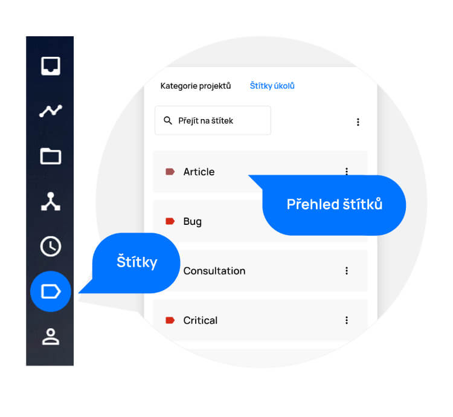
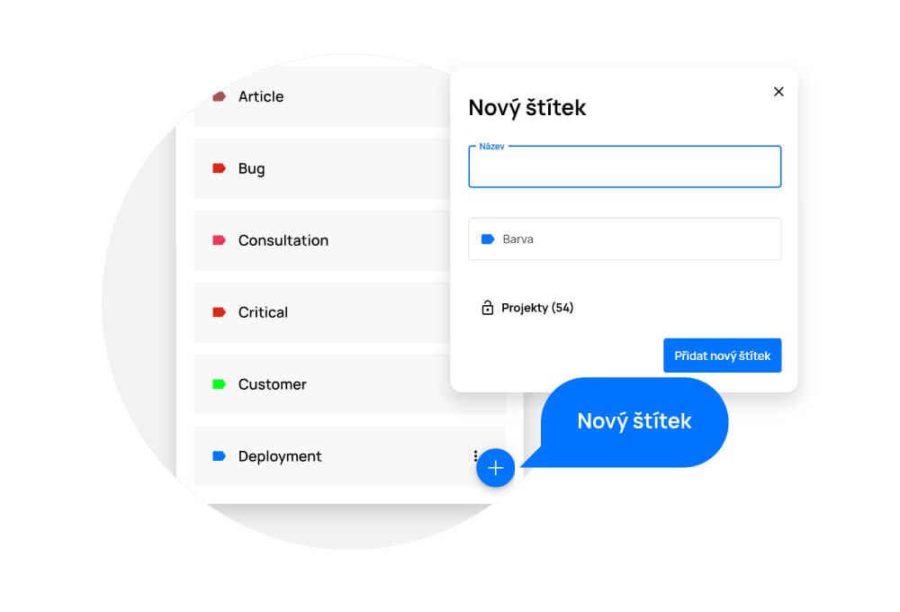
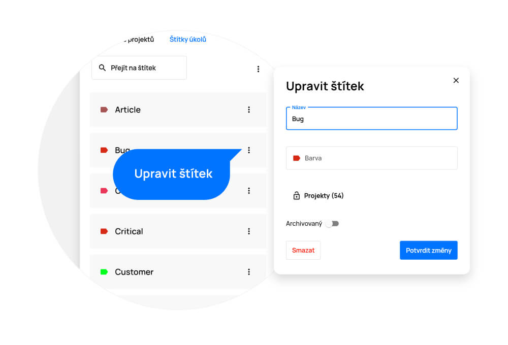
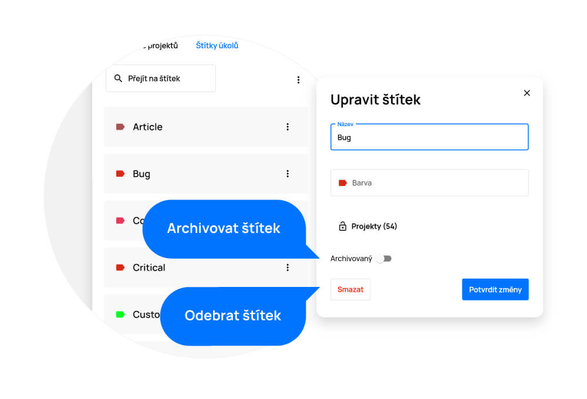

# Štítky, kategorie, skupiny

> Štítky, kategorie a skupiny slouží k označení úkolů, projektů a uživatelů pro lepší orientaci a přehlednost. Pokud budete úkoly těmito štítky označovat, můžete je pomocí nich filtrovat. Stejně tak budete mít v projektech lepší přehled, pokud je budete kategorizovat. Skupiny uživatelů slouží např. K odlišení jednotlivých oddělení.

Štítky a kategorie naleznete na levém bočním menu, pod ikonkou štítku. Po kliknutí se dostanete do na přehled všech existujících štítků a kategorií.

<figure>
	<a href="../../assets/images/stitky-a-kategorie.jpg" title="Štítky, kategorie, skupiny" class="glightbox">
		
		<figcaption>Štítky, kategorie, skupiny</figcaption>
	</a>
</figure>

## Vytvoření štítku, kategorie, skupiny

- Zvolte v levém horním rohu prostředí, zda chcete spravovat kategorie projektů, štítky úkolů nebo skupiny uživatelů.
- Klikněte na tlačítko „+“ v pravém dolním rohu.
- V otevřeném okně vyplňte název štítku/kategorie/skupiny.
- Po kliknutí na pole „Barva“ vyberte požadovanou barvu.
- Pro uložení klikněte na tlačítko „Přidat nový štítek/kategorii/skupinu“.

<figure>
	<a href="../../assets/images/stitky-a-kategorie-pridani-stitku.jpg" title="Přidání štítku a kategorie" class="glightbox">
		
		<figcaption>Přidání štítku a kategorie</figcaption>
	</a>
</figure>

## Přiřazení štítku, kategorie, skupiny

- Štítky lze přiřadit přímo na detailu úkolu či při vytváření úkolu.
- Kategorie lze přiřadit přímo na detailu projektu či při vytváření projektu.
- Skupiny uživatelů lze přiřadit přímo v sekci „Lidé“ či při přidávání nového uživatele.

## Úprava štítku, kategorie, skupiny
Pokud chcete štítek, kategorii či skupinu upravit, klikněte na nabídku „Více“ (tři tečky u štítku/kategorie/skupiny), klikněte na možnost „Upravit“ a poté je upravte.

Provedené změny uložte tlačítkem „Potvrdit změny“.

<figure>
	<a href="../../assets/images/stitky-a-kategorie-uprava-stitku.jpg" title="Úprava štítku a kategorie" class="glightbox">
		
		<figcaption>Úprava štítku a kategorie</figcaption>
	</a>
</figure>

## Odstranění štítku, kategorie, skupiny
Pokud chcete štítek, kategorii či skupinu odstranit, klikněte na nabídku „Více“ (tři tečky u štítku/kategorie/skupiny), klikněte na možnost „Upravit“ a poté na tlačítko „Smazat“.

Provedené změny uložte tlačítkem „Potvrdit změny“.

<figure>
	<a href="../../assets/images/stitky-a-kategorie-odstraneni-stitku.jpg" title="Odstranění štítku, kategorie, skupiny" class="glightbox">
		
		<figcaption>Odstranění štítku, kategorie, skupiny</figcaption>
	</a>
</figure>