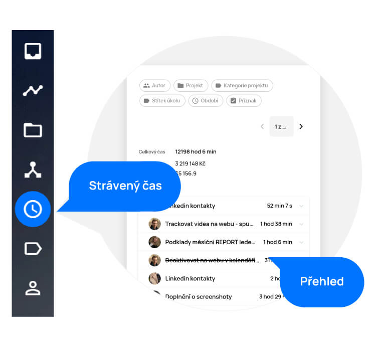
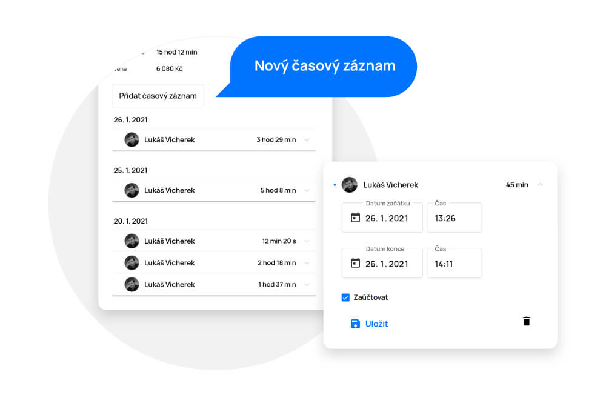
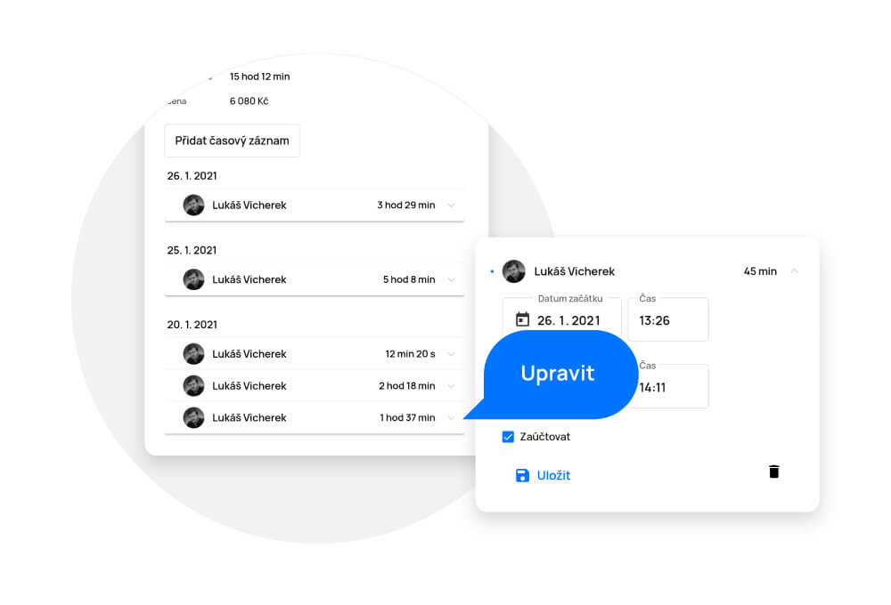
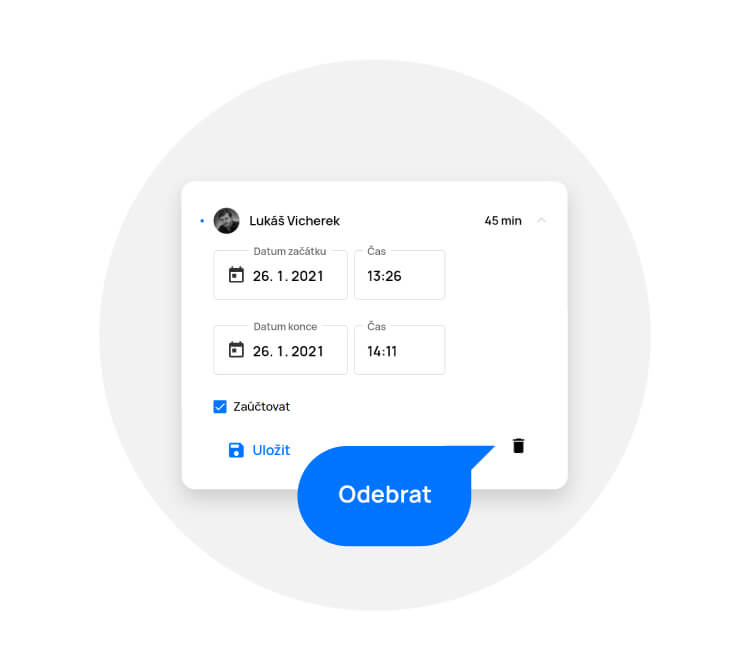

# Strávený čas

> V sekci „Strávený čas“ najdete přehled odpracovaného času a nákladů na úkolech jednotlivých pracovníků, seřazených sestupně podle data. Pokud má pracovník nastavenou hodinovou sazbu v sekci „Lidé“, můžete také měřit jeho částku za odpracovaný čas.

<figure>
	<a href="../../../assets/images/cs/straveny-cas.jpg" title="Strávený čas" class="glightbox">
		
		<figcaption>Strávený čas</figcaption>
	</a>
</figure>

## Zobrazení a úprava stráveného času

- Strávený čas můžete vyhledávat pomocí filtru na začátku sekce podle pracovníka (autor), projektu (projekt) a data (odpracováno).
- Rozbalením řádku zobrazíte podrobnosti o délce stráveného času nad úkolem, kde je možné svůj časový záznam přidat, upravit či odebrat. Také tam vidíte zaškrtávací políčko s názvem „Zaúčtovat“. To se dá využít, pokud máte u uživatele nastavenou hodinovou sazbu. Při jeho zaškrtnutí uvidíte náklady za čas, který strávil nad jednotlivými úkoly.
- Pomocí šipky v podrobnostech zobrazíte detail úkolu.

Pokud chcete upravit strávený čas na jakémkoliv úkolu, stačí přejít na jeho detail a provést akci pomocí tlačítka „Přidat časový záznam“. Rovnou tam také můžete částku zaúčtovat.

<figure>
	<a href="../../../assets/images/cs/straveny-cas-pridani.jpg" title="Zobrazení a úprava stráveného času" class="glightbox">
		
		<figcaption>Zobrazení a úprava stráveného času</figcaption>
	</a>
</figure>

Pokud chcete časový záznam pouze upravit, stačí rozbalit daný slot s časem rozbalit a na místě informace změnit.

<figure>
	<a href="../../../assets/images/cs/straveny-cas-upraveni.jpg" title="Zobrazení a úprava stráveného času" class="glightbox">
		
		<figcaption></figcaption>
	</a>
</figure>

Pokud chcete časový záznam odebrat, stačí použít tlačítko koše.

<figure>
	<a href="../../../assets/images/cs/straveny-cas-odebrani.jpg" title="Zobrazení a úprava stráveného času" class="glightbox">
		
		<figcaption>Zobrazení a úprava stráveného času</figcaption>
	</a>
</figure>