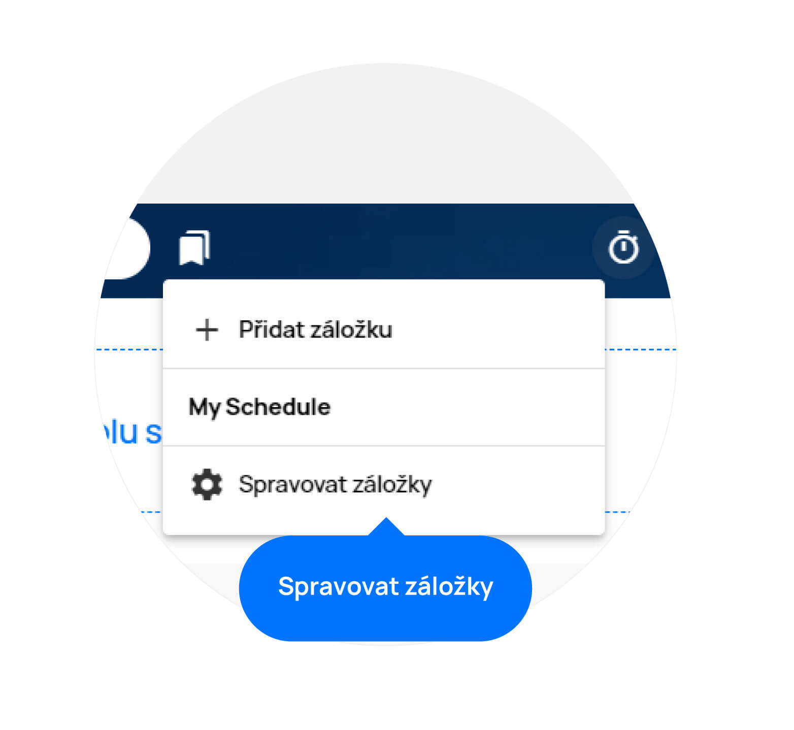

# Záložky

>Nejkratší cesta k vašim důležitým věcem. Do záložek si můžete uložit projekty či úkoly, na kterých zrovna pracujete nebo jakékoliv části aplikace, které navštěvujete nejčastěji.

Záložky naleznete vedle vyhledávacího pole v horní části aplikace. Po jejich rozkliknutí se dostanete na jejich seznam.

## Vytvoření záložky
Pro vytvoření záložky stačí přejít na stránku, kterou chcete uložit, kliknout na ikonku záložek a poté na políčko „Přidat záložku“. Stránka se vám uloží do seznamu.

<figure class="large_image">
	<a href="../../../assets/images/zalozky-vytvoreni-zalozky.jpg" title="Vytvoření záložky" class="glightbox">
		
		<figcaption>Vytvoření záložky</figcaption>
	</a>
</figure>

## Správa záložek
Své záložky můžete také upravovat, přesouvat či mazat pomocí možnosti „Spravovat záložky“. Tu najdete po rozkliknutí záložek v dolní části okna. Pomocí levého tlačítka můžete přetáhnout záložku na jinou pozici a tím si je např. Seřadit dle důležitosti. Pomocí tužky si můžete záložku přejmenovat a pomocí koše ji odstranit.

<figure class="large_image">
	<a href="../../../assets/images/zalozky-sprava-zalozek.jpg" title="Správa záložek" class="glightbox">
		
		<figcaption>Správa záložek</figcaption>
	</a>
</figure>