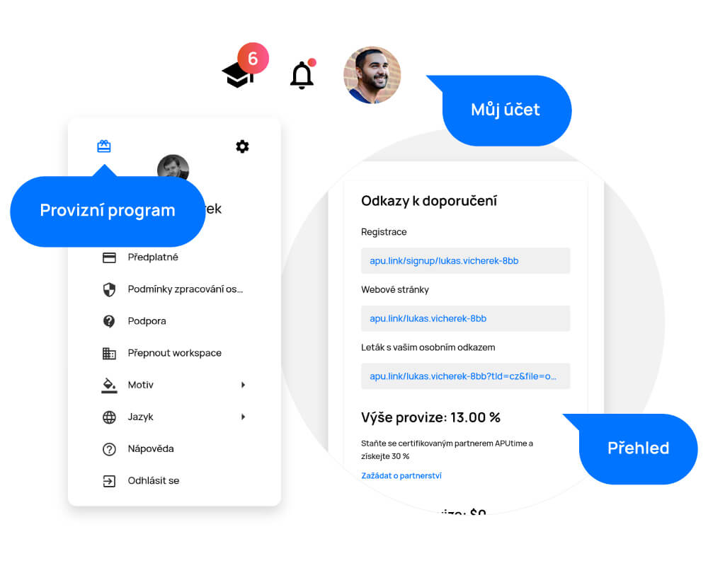

# Affiliate

> We offer our users a commission program. Recommend APU to companies in your area and earn up to 30% commission on each payment. APU can thus become a source of passive income.

After clicking on your profile, you will find the "gift" icon in the upper left corner of the expanded menu. By clicking on the ‘Let’s get started’ button, you can join the affiliate program.

<figure>
	<a href="../../assets/images/provizni-system.jpg" title="Affiliate" class="glightbox">
		
		<figcaption>Affiliate</figcaption>
	</a>
</figure>

## Referral links

You will find your personal links in the "Referral links" section. When someone uses them to register and become an APU user, you will receive a 13% commission on their payment each month.

If you would like to become our partner and get a 30% commission for each new user, you can apply for a partnership.

On the right side of the “Referral links” section you can see the amount of your monthly commission rate and the pending commission, as well as the potential amount (the user has registered through you, but still uses the free version).

<figure>
	<a href="../../assets/images/referral-links.jpg" title="Referral links" class="glightbox">
		
		<figcaption>Referral links</figcaption>
	</a>
</figure>

## List of connected apps

In the list of connected apps, you can see who started using APU through your referral link.

<figure>
	<a href="../../assets/images/list-of-connected-apps.jpg" title="List of connected apps" class="glightbox">
		
		<figcaption>List of connected apps</figcaption>
	</a>
</figure>

## Commission calculator

In the interactive calculator, you can calculate how many users need to be recommended to reach your desired monthly amount.

<figure>
	<a href="../../assets/images/commission-calculator.jpg" title="Commission calculator" class="glightbox">
		
		<figcaption>Commission calculator</figcaption>
	</a>
</figure>

## Materials and references

If you need any materials for your recommendation, download them here. Presentations and video demonstrations are always at hand. If you would like to get something extra, just click on the "Let us know" button and you can let us know what materials you need.