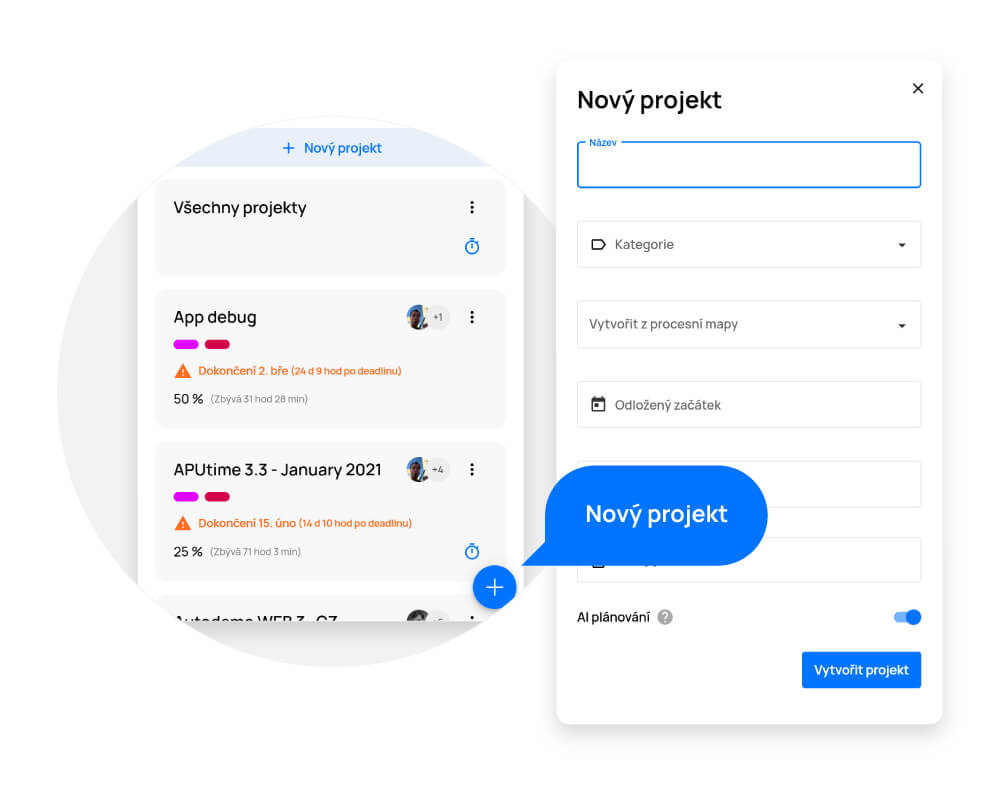

# Projects

> In this section you can find an overview of all projects you have access to, sorted according to their current priority. With projects that require your attention at the top, e.g. due to missing the completion date. Directly on the given project tile you can also see what percentage of the project is completed and to which category the project belongs.

By clicking on the folder icon on the left side menu, you will get to the "Projects" section and get an overview of all projects in the company.

<figure>
	<a href="../../assets/images/projects.jpg" title="Projects" class="glightbox">
		
		<figcaption>Projects</figcaption>
	</a>
</figure>

## Creating a project

- Use the "+" button in the lower right corner to open the menu for creating a new project.
- Enter the project name in the "New project" menu.
- Assign the project to a category. Doing this will enable you to easily filter projects marked in this way.
- Set a deadline for its completion (this is an important step, because the deadline determines the priority among other projects on the Gantt.AI ™ timeline)
- You can also set a delayed start here (the date from which the project is going to be planned on Gantt.AI™).
- The "People" button displays a submenu where you can specify which users are assigned to this project.
- Once a user is assigned to the project, they have a default assigned role (rights) in that project. You can change the assigned role by clicking on the menu and then selecting from three options (Manager, Participant, Restricted Participant).

To finish creating the project , click on the "Create" button.

<figure>
	<a href="../../assets/images/projekty-vytvoreni-projektu.jpg" title="Vytvoření projektu" class="glightbox">
		
		<figcaption>Vytvoření projektu</figcaption>
	</a>
</figure>

## Project editing

There are two ways to edit the project:

1. In the "Projects" section on a given project tile, click on the "More" button (three dots) and select "Edit"
2. In the project detail (open project), click on the pencil icon at the upper right corner.

Always save the changes with the "Confirm changes" button.

<figure>
	<a href="../../assets/images/projects-project-editing.jpg" title="Project editing" class="glightbox">
		
		<figcaption>Project editing</figcaption>
	</a>
</figure>

## Archiving / Deleting a project

### Bin
If you want to delete the project completely with all its data, click on the "More" button (three dots) on the project tile and select "Edit". At the end of the floating window, you see the "Delete" button on the left. The project will be deleted but will remain in the bin for 14 days if you needed to restore it.

### Archive
If you want to archive the project with all its data, click on the "More" button (three dots) on the project tile and select "Edit". At the bottom of the floating window, you see a toggle button that you can use to archive the project. Whenever you need to view a project and its tasks again, just click on the "More" button (three dots) in the list of projects and select "Archived", where you see a list of all projects that have ever been archived. If you want to restore the project, just move the dot on the toggle button within the project detail.

<figure>
	<a href="../../assets/images/projects-archiving-deleting-a-project.jpg" title="Archiving / Deleting a project" class="glightbox">
		
		<figcaption>Archiving / Deleting a project</figcaption>
	</a>
</figure>

## Project tiles

On the tile of each project you can see what state the project is in (percentage of completion) and the planned date of its completion. An animated stopwatch icon symbolizes that one of the project tasks is currently being worked on. Click on the project tile to view the project detail.

Click on the "More" button (three dots) to open a menu where you can edit the project, view the time spent (find out how much time was spent on the whole project or on individual tasks), or view its process in ProjectFormation ™.

<figure>
	<a href="../../assets/images/projects-project-tiles.jpg" title="Project tiles" class="glightbox">
		
		<figcaption>Project tiles</figcaption>
	</a>
</figure>

## Project detail

You can get to the project detail by clicking on the tile of a given project in the Projects section.
In this detail you will find clear information about the project, including a complete list of tasks and you can also add and edit tasks.

Using the drop-down menu in the upper left corner, you can easily switch between the other projects you want to view.

- **Editing a project** - Click on the pencil icon to open the project details available to edit.
- **Files** - By clicking on the files tab, you get to a complete list of all files that are important within the project.
- **Show in ProjectFormation™** - by clicking on the "Process" tab, open the project in a graphic interface directly in the ProjectFormation ™ tool, in which you can edit the project processes. To return to the project overview, click on the "Overview" tab
- **Filters** - allows tasks to be filtered according to their parameters (e.g. according to the solver, author, status, etc.)
- **To-do list** - an overview of all tasks assigned to the project
- **Task detail** - click on the task to open its detail (all information on the task will be displayed with the possibility to edit it)

<figure>
	<a href="../../assets/images/projects-project-detail.jpg" title="Project detail" class="glightbox">
		
		<figcaption>Project detail</figcaption>
	</a>
</figure>

## Project Decisions

If a project needs to be executed during the decision process a notification is displayed to the project coordinator on the project tile and in the project detail.

Clicking the button opens the decision menu. Based on your decision, further tasks will be scheduled.

You will always receive a reminder about the pending decision in a project by e-mail as well.

<figure>
	<a href="../../assets/images/projects-project-decisions.jpg" title="Project Decisions" class="glightbox">
		
		<figcaption>Project Decisions</figcaption>
	</a>
</figure>

## Creating a task in a project
Click the "+" button in the lower right corner of the project to open the menu for creating a new task.
You can also create tasks in Project Formation ™ and in the "My Schedule" section as well.

<figure>
	<a href="../../assets/images/projects-creating-a-task-in-a-project.jpg" title="Creating a task in a project" class="glightbox">
		
		<figcaption>Creating a task in a project</figcaption>
	</a>
</figure>

## List of tasks in the project
To view a list of tasks in a project, open the project (click on the tile) in the "Projects" section.

You can easily search for tasks in the list using filters (task label, task category, solver, task type, time, status, and author).

**The task preview contains:**

- Status (circle at the beginning of the line)
	- blue = the task can be worked on
	- grey = the task is waiting for continuity (completion of the previous task) or you are not its solver
- Name of the task
- Task solvers
- Time when the task is scheduled to start
- Warning of impending deadline. If the set deadline is approaching, you will see an orange exclamation mark notifying you how long the deadline will be exceeded. If the deadline has already been exceeded, you will see a red exclamation mark notifying you how long it has been after the deadline.

<figure>
	<a href="../../assets/images/projects-list-of-tasks-in-the-project.jpg" title="List of tasks in the project" class="glightbox">
		
		<figcaption>List of tasks in the project</figcaption>
	</a>
</figure>

## Bulk editing of tasks

Allows quick editing (moving to another project, marking labels, changing the solver, editing the status) of tasks directly in the list.

- Click and hold a task bar to select it (you can quickly select other tasks by checking the box at the beginning of the line).
- Once selected, click the "Edit" button that appears at the top of the list and select the desired edits from the menu that opens.
- Click the "Save" button to save the changes.

**Note:** All changes made must always be saved with the floppy disk button in the lower right corner.

<figure>
	<a href="../../assets/images/projects-bulk-editing-of-tasks.jpg" title="Bulk editing of tasks" class="glightbox">
		
		<figcaption>Bulk editing of tasks</figcaption>
	</a>
</figure>

## Creating a template from an existing project

You can create a process map template from an existing project by duplicating it (the original process/project will be left unchanged).

- Display the project in ProjectFormation™ - click on the "More" icon (three dots) on the project tile and select "Show in ProjectFormation™" or you can click on the process icon directly on the top right of the project detail and also select "Show in ProjectFormation™".
- After opening the process in the graphical interface, click on the "More" icon (three dots) in the control panel and select "Duplicate as process map".
- Now you can freely edit the process map or just save it as a template.

Finally, select the floppy disk button in the controls and choose how you want to save the map.

<figure>
	<a href="../../assets/images/projetcs-creating-a-template.jpg" title="Creating a template from an existing project" class="glightbox">
		
		<figcaption>Creating a template from an existing project</figcaption>
	</a>
</figure>

## Importing a process map
If you already have a process map stored on your PC, you can simply import it using the "Import" button, which can be found in the floating bar in the upper right corner after clicking on "More" (three dots).

<figure>
	<a href="../../assets/images/projects-importing-a-process-map.jpg" title="Importing a process map" class="glightbox">
		
		<figcaption>Importing a process map</figcaption>
	</a>
</figure>

## Exporting a process map
If you want to export (download) the process map, just use the "Export" button, which can be found in the floating bar in the upper right corner after clicking on "More" (three dots). Then the process map will be downloaded in .json format which can be saved or sent..

<figure>
	<a href="../../assets/images/projects-exporting-a-process-map.jpg" title="Exporting a process map" class="glightbox">
		
		<figcaption>Exporting a process map</figcaption>
	</a>
</figure>

## Printing a process map
You can easily print the process map using the "Open printer" button, which can be found in the floating bar in the upper right corner after clicking on "More" (three dots). Your process map will open in a new window in print quality - right-click anywhere in the window and select "Print".

<figure>
	<a href="../../assets/images/projects-printing-a-process-map.jpg" title="Printing a process map" class="glightbox">
		
		<figcaption>Printing a process map</figcaption>
	</a>
</figure>