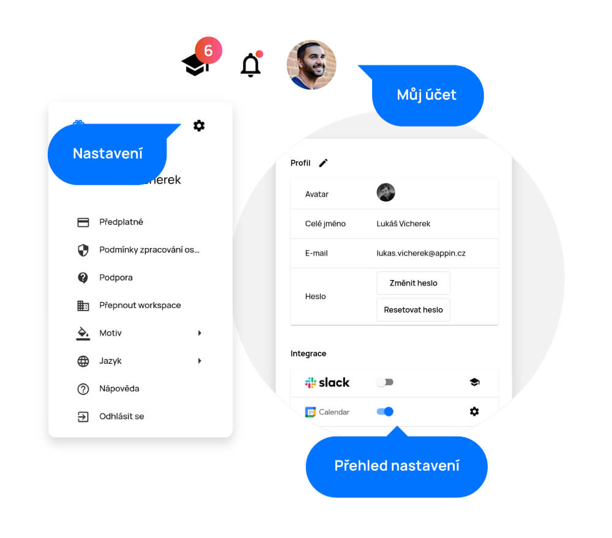

# Settings

> In the "Settings" section, you can edit your profile picture, name, email or change your password. You can also set up all integrations here. Connect APU to Slack, Google Calendar, Microsoft Calendar or get an API key for integration with other tools.

Nastavení najdete po rozkliknutí svého profilu v pravém horním rohu rozbalovací nabídky pod ozubeným kolečkem.

<figure>
	<a href="../../assets/images/nastaveni.jpg" title="Nastavení" class="glightbox">
		
		<figcaption>Nastavení</figcaption>
	</a>
</figure>

## Edit profile

In the first part of the settings page, you can change basic information such as profile picture, name, email or password. All you have to do is click on the pencil icon, edit whatever you want and click on the "Save" button.

<figure>
	<a href="../../assets/images/edit-profile.jpg" title="Edit profile" class="glightbox">
		
		<figcaption>Edit profile</figcaption>
	</a>
</figure>

## Integration

If you use any other tools and want to connect them with APU for easier use, you can do so in this setup section.

- You can connect APU to Slack by clicking on the Slack toggle button. You will be redirected to the Slack page, where you just click on the "Allow" button and enable two-way Slack integration by clicking on the "It's my request" button. You will get APU’s greeting message in slack short after!
The two-way integration of Slack allows you to manage things in our platform directly through the slack channel. We can also sometimes send important notifications about tasks and comments. You can start a thread to place your comment or answer to the posts from your colleagues.

We currently support these shortcuts:

| Shortcut                               | Description                                    |
| ------------------------------------- | ---------------------------------------- |
| /task [?Task NAME]                  | Opens a new Task dialog |
| /start [Task CODE]                  | Starts the Timer                          |
| /stop                               | Stops the Timer                         |
| /done [Task CODE]                   | Close the Task                          |
| /comment [Task CODE] [Comment]      | Place the Comment for the Task     |
| /my [Any string or predicates]    | Shows your agenda                     |
| /find [Any string or predicates] | Searches for the tasks                    |

Note: You can find the task code in the URL of the given task detail.

You can disable our integration easily through managing connected apps in your Slack settings:
https://[YOUR-WORKSPACE].slack.com/apps/manage

- To link Google Calendar, simply click on the toggle button. You will be redirected to the Google login page where you select the email you want to use for synchronization. Enter the password for your account and then select which calendars do you want to synchronize with APU.
- To link Microsoft Calendar, simply click on the toggle button. You will be redirected to the Microsoft login page, where you select the email you want to use for synchronization. Enter the password for your account and then select which calendars do you want to synchronize with APU.

<figure>
	<a href="../../assets/images/integration.jpg" title="Integration" class="glightbox">
		
		<figcaption>Integration</figcaption>
	</a>
</figure>

The events in your calendar can be seen only by project managers and management. If you have any events in your calendar marked as ‘private’, they won’t be displayed with information, management will only see that you are not available at that given time.