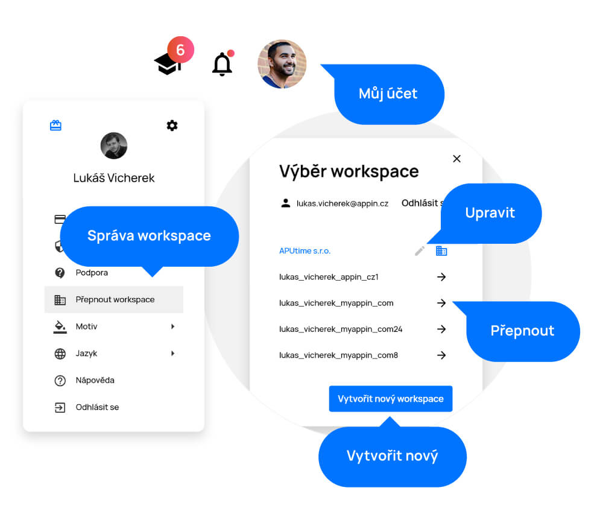

# Workspace

> Workspaces are separate workgroups that have nothing to do with each other. For example, it could be the agenda of two different companies that you need to access from one account. You can name your workspace as you want and also delete it at any time.

## Adding a workspace

You can find the option to create a workspace in the "My Account" menu in the upper right corner of the screen by clicking on your profile picture. After clicking on "Switch workspace", a menu with your workspaces will appear. In this menu, click on the "Create workspace" button. In the next step, name your workspace and click the "Create" button.

<figure>
	<a href="../../assets/images/workspace.jpg" title="Workspace" class="glightbox">
		
		<figcaption>Workspace</figcaption>
	</a>
</figure>

## Switching workspaces

You can find the option to change workspaces in the "My Account" menu in the upper right corner of the screen by clicking on your profile picture. After clicking on "Switch workspace", you see a menu with all the workspaces you have created and also the ones you have been invited to. You can easily switch workspaces at any time.